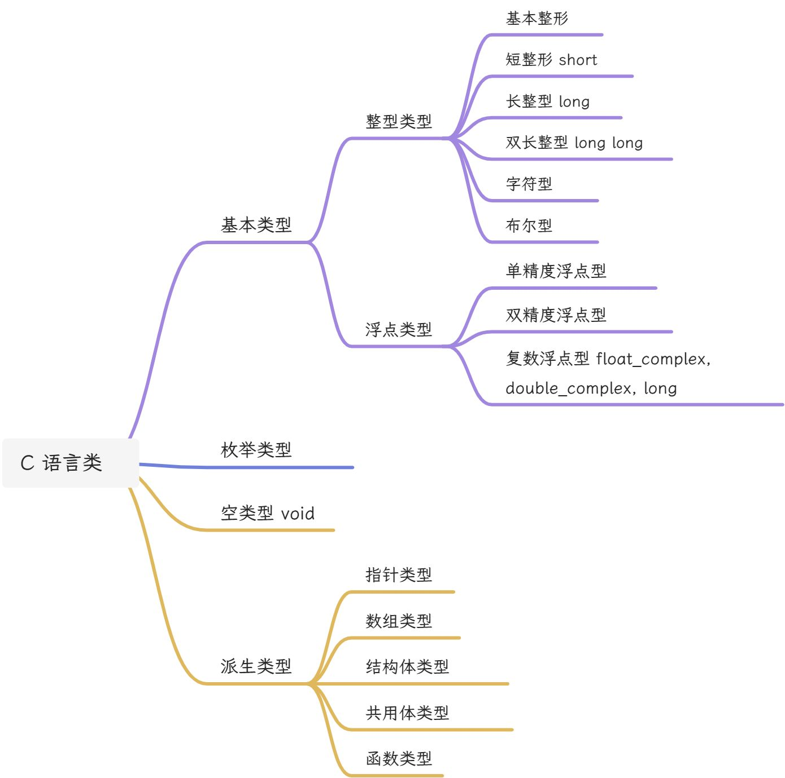

---
head:
  - - link
    - rel: stylesheet
      href: https://cdnjs.cloudflare.com/ajax/libs/KaTeX/0.5.1/katex.min.css
---

# 02 - 数据类型

## 1 常量与变量

### 1.1 常量

1. 整形常量
1. 实型常量
   - 十进制小数形式
   - 指数形式：$12.34e3$(代表$12.34\times 10^3$)
3. 字符常量
   - 普通字符：用单引号表示，单引号里只能有一个字符。字符变量以 ASCII 代码的形式储存
   - 转义字符

| 转义字符 | 字符值 | 输出结果 |
| :---: | --- | --- |
| `\\a` | 警告 alert | 产生视觉或声音信号 |
| `\\b` | 退格 backspace | 将光标当前位置后退一个字符 |
| `\\f` | 换页 form feed | 将光标位置移到下一页开头 |
| `\\n` | 换行 | 将光标位置移到下一行开头 |
| `\\r` | 回车 carriage return | 将光标位置移到本行开头 |
| `\\t` | 水平制表符 | 将光标位置移到下一个 Tab 位置 |
| `\\v` | 垂直制表符 | 将光标位置移到下一个垂直制表符对齐点 |
| `\\o` 或 `\\oo` 或 `\\ooo`(其中 `o` 代表一个八进制数字) | 与该八进制码对应的 ASCII 字符 |  |
| `\\xh[h...]`(其中 `h` 代表一个十六进制数字) | 与该十六进制码对应的 ASCII 字符 |  |

4. 字符串：用双引号表示
5. 符号变量：用 `#define` 指令，指定用一个符号代表一个常量

```c
#define PI 3.1416
```

符号常量不是变量！符号常量不占用内存，只是作为一个临时符号，代表一个值，在预编译后这个符号就不存在了，一次不能对符号变量重新赋值。为与变量名区别，习惯上符号常量用大写字母表示。

### 1.2 变量

变量必须先定义后使用。变量名实际是以一个名字代表的存储地址。编译时，系统给每一个变量名分配对应的内存地址。从表变量中取值，实际上是通过变量名找到对应的内存地址，从该存储单元中读取数据。

### 1.3 常变量

C99 标准允许使用常变量，方法是定义变量时在前面加一个 `const`，该变量存在期间其值不能改变。

**常变量与常量：**

- 常变量具有变量的基本属性：有类型，占存储单元，只是不允许改变值。
- 常变量是有名字的不变量，常量是无名字的不变量。

**常变量与符号变量：**

- 符号变量是预编译指令，它只是用符号常量代表一个字符串，在预编译时仅进行字符替换，编译后符号常量就不存在了(被值代替)，符号常量的名字不分配存储单元。
- 串并联占用存储单元，有变量值，只是不能改变。
- 从使用上看，常变量具有符号变量的优点，而且使用更方便，有常变量时可以不使用符号常量。但有些编译系统还未实现 C99 的功能，不能使用常变量。

### 1.4 标识符

用来对常量名、函数、数组、类型等命名的有效字符序列统称为标识符(identifier)。标识符就是一个对象的名字。
C 语言规定标识符只能由字母、下划线、数字组成，且第一个字符必须为字母。大小写字母是两个不同的字符。习惯上变量名使用小写字母。

## 2 数据类型

类型是指对数据分配存储单元的安排，包括存储单元的长度(占多少字节)一级数据的存储方式。不同的类型分配不同的长度和储存形式。
计算机进行的计算不是抽象的理论值的计算，而是用工程的方法实现的计算，在许多情况下只能得到近似的结果。

C99 允许使用的类型包括：



基本类型和枚举类型的变量都是数值，统称为算术类型(arithmetic type)。算术类型和指针类型的变量都是用数字来表示的，统称为纯量类型(scalar type)。枚举类型是程序中用户自定义的整数类型。数组类型和结构体类型统称为组合类型(aggregate type)。共用体类型不属于组合类型，因为在同一时间内只有一个成员具有值。

### 2.1 整形

C 标准没有规定各种类型数据占用的存储单元长度，这是由编译系统自行决定的。如 Turbo C 2.0 为每个 `int` 分配 2 个字节(16 个二进位)，而 Visual C++ 分配 4 个字节(32 个二进位)。C 标准只要求 `long` 型数据长度不短于 `int` 型，`short` 型不长于 `int` 型，`long long` 型最长。

可以使用 `sizeof(int)` 来查看类型或变量的长度。将一个程序移植到另一个系统时，要注意由于编译系统的不同引起的数据溢出。

存储单元存储整数的方法是：使用整数的补码(complement)。

- 一个正数的补码是其二进制形式。
- 求负数的补码，先将其绝对值写成二进制形式，让后对其二进制按位取反，再加 1

在储存整数的储存单元中，最左边的一位是用来表示符号的，如果为 0，表示数值为正；如果为 1，表示数值为负。由此可以得到整数型数据的范围(按 Visual C++)：

| 类型 | 字节数 | 取值范围 |
| --- | --- | --- |
| 基本整型 `int` | 4 | $-2^{31} \sim (2^{31}-1)$ |
| 无符号基本整型 `unsigned int` | 4 | $0\sim (2^{32}-1)$ |
| 短整型 `short` | 2 | $-2^{15}\sim (2^{15}-1)$ |
| 无符号短整型 `unsigned short` | 2 | $0\sim (2^{16}-1)$ |
| 长整型 `long` | 4 | $-2^{31} \sim (2^{31}-1)$ |
| 无符号长整型 `unsigned long` | 4 | $0\sim (2^{32}-1)$ |
| 双长型 `long long` | 8 | $-2^{63}\sim (2^{63}-1)$ |
| 无符号双长型 `unsigned long long` | 8 | $0\sim (2^{64}-1)$ |

修饰符 `unsigned` 表示无符号类型，即只能取正值。使用 `signed` 表示有符号类型，通常省略 `signed`。有符号整形的最高位表示数值的符号，如果指定为无符号类型，则存储单元中所有的二进制位都用来存放数据本身，因此无符号整形可以存放的正数范围比有符号整型扩大一倍。

只有整型数据可以用 `signed` 和 `unsigned` 修饰，实型数据不能。无符号整型数据用 `%u` 格式输出。

### 2.2 字符型

由于字符型是按照其代码形式存储的，因此 C99 把字符型数据作为整型数据的一种。

各种字符集(包括 ASCII 字符集)的基本集都包括 127 个字符：

- 大小写字母。
- 数字：0-9。
- 专门符号 29 个：! & < 等。
- 空格符：空格、制表符、换行符等。
- 不能显示的字符：空(null)字符 `\0`、警告、退格等。

以类型符 `char` 定义字符变量，可以将 0-127 之间的整数赋值给字符变量，输出时也可以选择以十进制整数形式或字符形式输出。

```c
char c;
c = 64;
printf("%d %c\n", c, c);

// 64 @
```

字符类型属于整数类型，可以使用 `signed` 和 `unsigned` 修饰。127 个字符可以用 7 个二进位来表示，C 语言中指定用一个字节(8 位)储存一个字符(所有系统都不例外)，此时，字节中的第一位置为 0。有些系统提供的字符集拓展到了 255 个字符，此时需要把二进位中不用的那一位用起来，把 `char` 修改为 `unsigned char`。

### 2.3 浮点型

浮点型数据表示具有小数点的实数。C 语言中实数是以指数的形式放在存储单元的，由于一个实数的的指数形式不止一种，即小数点是可以浮动的，因此称为浮点型。

编译系统位 `float` 型变量分配 4 个字节，将小数部分和指数部分分别存放，4 个字节(32 位)中小数部分和指数部分分别占多少位由编译系统自行决定。由于用二进制表示一个实数以及存储单元长度有限，因此不可能得到完全精确的值。小数部分位数越多，精度越高；指数部分位数越多，能表示的数据范围越大。`float` 型数据能得到 6 位有效数字，数值范围为 $-3.4\times 10^{-38} \sim 3.4 \times 10^{38}$。

为了扩大能表示的数据范围，用 8 个字节储存一个 `double` 型数据，可以得到 15 位有效数字，数值范围位 $-1.7\times 10^{-308} \sim 1.7 \times 10^{308}$。为了提高计算精度，C 语言在进行浮点数的算术运算时，将 `float` 型数据都自动转为 `double` 型数据，然后进行运算。

不同的编译系统对 `long double` 的处理方式不同。Turbo C 对 `long double` 型分配 16 个字节，而 Visual C++对 `long double` 和 `double` 的处理方式一样，都分配 8 个字节。

## 3 运算符和表达式

C 语言提供以下运算符：

- 算术运算符：`+ - * / % ++ --`
- 关系运算符：`> < == >= <= !=`
- 逻辑运算符：`! && ||`
- 位运算符：`<< >> ~ | ^ &`
- 赋值运算符：`=`
- 条件运算符：`?: `
- 逗号运算符：`,`
- 指针运算符：`* &`
- 求字节运算符：`sizeof`
- 强制类型运算转换符：`(type)`
- 成员运算符：`. ->`
- 下标运算符：`[]`
- 其他：如函数调用运算符 `()`

### 3.1 基本算数运算符

| 运算符 | 含义 |
| :---: | --- |
| `+` | 正号或加法 |
| `-` | 负号或减法 |
| `*` | 乘号 |
| `/` | 除号 |
| `%` | 取余 |

两个实数相除，结果为双精度实数。两个整数相除，结果位整数，舍去小数部分，但如果结果为负数，舍去的方向是不一定的，由编译系统决定。多数编译系统采取“向零取整”的方法，即取整后向零靠拢。

### 3.2 自增自减运算符

自增和自减运算符的作用是使变量的值加 1 或减 1：

- `++i`，`--i`：使用 `i` 之前，先使 `i` 的值加(减)1
- `i++`，`i--`：使用 `i` 之后，使 `i` 的值加(减)1

```c
int i = 3;
printf("%d\t", i++);
printf("%d\n", ++i);

// 3    5
```

### 3.3 算术表达式与运算符的优先级与结合性

C 语言规定运算符是优先级：如先乘除后加减。

如果一个运算对象两侧的运算符优先级相同，则按规定的“结合方向”处理：算术运算符的结合方向都是自左向右，赋值运算符的结合方向是自右向左。“结合性”是 C 语言独有的特性之一。

### 3.4 不同数据类型的混合运算

- 运算的两个数中有 `float` 或 `double` 时，结果位 `double`。
- 字符型数据与整型或实型数据进行运算时，会先将字符型转换为整型或实型。

### 3.5 强制类型转换符

使用 `(类型)(表达式)` 可以将一个表达式强制转换为所需的形式。

```c
(float)(5%3)
```
