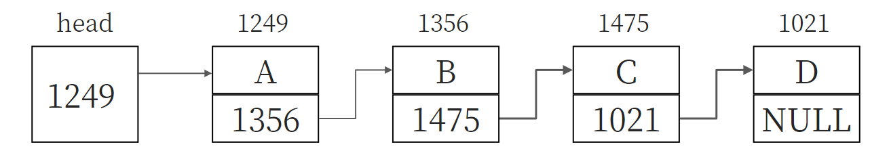

# 09 - 自定义数据类型

## 1 定义和使用结构体变量

### 1.1 定义结构体类型

前面定义使用的变量基本是相互独立、五无在联系的，在内存中的地址也是互不相干的。但在实际生活和工作中，有些数据是有内在联系的、成组出现的。例如，一个学生的学号、姓名、性别、年龄等，是属于同一个学生的。如果将这些变量分别定义为相互独立的简单变量，难以反映他们之间的内在联系，而数组又只能存放同一类型的数据。

C 语言允许用户自己建立又不同类型数据组成的数据结构，称为**结构体**(structure)。其他一些高级语言中也称为“记录”(record)。声明一个结构体类型的一般形式为：

```c
struct 结构体名 { 成员表列 };
```

其中，`struct` 是声明结构体类型的关键字，不可省略。结构体名由用户指定，又称为结构体标记(structure tag)，以区别于其他结构体类型。成员表列(member list)也称为域表(field list)，每一个成员是结构体中的一个域。成员名命名规则与变量名相同。结构体的成员也可以是另一个结构体。

也成为上面的例子声明结构体类型如下：

```c
struct Student {
    char id[10];
    char name[20];
    char sex;
    int age;
}
```

结构体类型和系统提供的标准类型具有相似作用，都可以用来定义变量。

### 1.2 定义结构体类型变量

定义了结构体类型后，未来在程序中使用结构体类型的数据，应该定义结构体类型变量，并在其中存放数据。可以采取 3 种方法定义结构体类型变量。

#### 先声明结构体类型，再定义该类型的变量

可以使用上面定义的结构体类型 `struct Student` 来定义变量：

```c
struct Student student1, student2;
```

这种形式和定义其他基本类型的变量是相似的。上面定义了 `student1` 和 `student2` 为 `struct Student` 类型的变量。

这种方式是声明类型和定义变量分离，在声明类型后可以随时定义变量，比较灵活。

#### 在声明类型的同时定义变量

这种定义方法的一般形式为：

```c
struct 结构体名 {
    成员表列
} 变量名表列;
```

例如：

```c
struct Student {
    char id[10];
    char name[20];
    char sex;
    int age;
} student1, student2;
```

小型程序中，该方法可以直接看到结构体的结构，比较直观方便。但在大型程序中，往往要求对结构体类型的声明和对变量的定义分别放在不同地方，以使程序结构清晰，便于维护。

#### 不指定类型名而直接定义结构体类型变量

其一般形式为：

```c
struct {
    成员表列
} 变量名表列;
```

该方法指定了一个无名的结构体类型，由于没有结构体名，因此不宜再次以此结构体类型去定义其他变量。

::: tip 注意
1. 结构体类型与结构体变量是不同的概念，编译时对类型不分配空间，只对变量分配空间。
2. 结构体类型中的成员名可以和程序中的变量名相同，但二者不代表同一个对象。
3. 结构体变量中的成员(即“域”)可以单独使用，它的作用和地位相当于普通变量。
:::

### 1.3 结构体变量的初始化和引用

定义结构体时，可以对其进行初始化，然后可以引用该变量。

```c
#include <stdio.h>

int main() {
    struct Student {
        char id[10];
        char name[20];
        char sex;
        int age;
    } a = {"20220629", "liuyuxin", 'M', 19};  // 定义结构体变量 a 并初始化
    printf("NO.: %s\nName: %s\nSex: %c\nAge: %d", a.id, a.name, a.sex, a.age);
    return 0;
}

// NO.: 20220629
// Name: liuyuxin
// Sex: M
// Age: 19
```

对结构体变量初始化时，初始化列表是用花括号括起来的一些常量，这些常量依次赋值给结构体变量中的各成员。C 99 标准允许支队某一成员初始化，如：

```c
struct Student b = {.name = "liuyuxin"};  // 成员名前由成员运算符 .
```

`.name` 代表结构体变量 `b` 中的成员 `b.name`。其他未被初始化的数值类型成员被系统初始化为 0，字符型成员被初始化为 `\0`，指针型成员被初始化为 `NULL`。

单独引用结构体变量中某一成员的值，其方法为：

```c
结构体变量名.成员名
```

如上面程序中的 `a.id` 和 `a.name` 等。也可以在程序中对这些成员赋值：

```c
b.age = 19;
```

::: tip 注意
不同企图通过输出结构体变量名来达到输出结构体变量所有成员的值！只能逐一对各个成员进行输入输出。
:::

如果成员本身又是一个结构体类型，则要用若干个成员运算符，一级一级找到最低一级的成员。只能对最低一级的成员进行赋值、存取和运算。但同类的结构体变量可以相互赋值，如：

```c
student1 = student2;  // student1 和 student2 都为 struct Student 类型变量
```

## 2 结构体数组

一个结构体变量中可以存放一组有关联的数据，如果有多组这样的数组需要参加运算，显然应该使用数组，这就是**结构体数组**。结构体数组的每个元素都是一个结构体类型的数据，都分别包括各个成员项。

定义结构体数组的一般形式为：

```c
struct 结构体名 {
    成员表列
} 数组名[数组长度];
```

对结构体数组的初始化可以在定义数组后面加上一个初值表列。

```c
struct Student {
    char name[20];
    int age;
} class[3] = {"liu", 19, "yuxin", 20};
```

## 3 结构体指针

### 3.1 指向结构体变量的指针

结构体指针就是指向结构体变量的指针，即结构体变量的起始地址。指向结构体对象的指针变量可以既可以指向结构体变量，也可以指向结构体数组中的元素，其基类型必须与结构体变量的类型相同。

```c
struct Student* p;  // p 可以指向 struct Student 类型的变量或数组元素
```

当 `p` 指向一个结构体变量 `stu` 时，以下 3 种用法等价：

1. `stu.成员名 ` 如：`stu.name`。
2. `(*p).成员名 ` 如：`(*p).name`。
3. `p->成员名 ` 如：`p->name`。

### 3.2 指向结构体数组的指针

可以用指针变量指向结构体数组的元素。

```c
#include <stdio.h>

struct Student {
    char name[20];
    int age;
};
struct Student class[3] = {{"liu", 19}, {"yu", 20}, {"xin", 21}};

int main() {
    struct Student* p;
    printf(" Name     Age\n");
    for (p = class; p < class + 3; p++)
        printf("%5s%8d\n", p->name, p->age);
    return 0;
}

//  Name     Age
//   liu      19
//    yu      20
//   xin      21
```

### 3.3 用结构体变量和结构体变量的指针做函数参数

将一个结构体变量的值传递给一个函数由 3 个方法：

1. 用结构体变量的成员做实参，传递给形参。用法与普通变量做形参一致，属于“值传递”的方式。
2. 用结构体变量做实参，形参也必须是同类型的结构体变量，也属于“值传递”方式。这种方式在时间和空间上的开销较大，且如果在执行被调用函数过程中该变量形参的值，该值不能返回主调函数，往往造成使用上的不便，因此较少使用。
3. 用指向结构体变量的(或数组元素)的指针做实参，将结构体变量(或数组元素)的地址传给形参。

下面的程序实现了输入 3 个学生 3 门课程的成绩，输出平均成绩最高的学生信息：

```c
#include <stdio.h>
#define N 3 // 学生数为 3

struct Student { // 建立结构体类型
    char name[20];
    float score[3];
    float aver;
};

int main() {
    void input(struct Student stu[]);
    struct Student max(struct Student stu[]);
    void print(struct Student stud);
    struct Student stu[N], *p = stu;
    input(p);
    print(max(p));
    return 0;
}

void input(struct Student stu[]) { // 输入学生姓名、3 门课成绩
    int i;
    for (i = 0; i < N; i++) {
        scanf("%s %f %f %f", stu[i].name, &stu[i].score[0], &stu[i].score[1],
              &stu[i].score[2]);
        stu[i].aver =
            (stu[i].score[0] + stu[i].score[1] + stu[i].score[2]) / 3.0;
    }
}

struct Student max(struct Student stu[]) { // 求平均成绩最高的学生
    int i, m = 0;
    for (i = 0; i < N; i++) {
        if (stu[i].aver > stu[m].aver)
            m = i;
    }
    return stu[m];
}

void print(struct Student stud) { // 输出成绩最高的学生的信息
    printf("Name: %s\nScore: %2.lf, %2.lf, %2.lf\nAver: %2.lf\n", stud.name,
           stud.score[0], stud.score[1], stud.score[2], stud.aver);
}
```

## 4 用指针处理链表

### 4.1 链表

**链表**是一种常见的重要的数据结构，它是动态地进行存储分配的一种结构。用数组存放数据时，必须事先定义固定的数组长度(即元素个数)，这样有时会浪费内存。链表则没有这种缺点，它根据需要开辟内存单元。下图表示最简单的一种链表(单向链表)的结构。



链表有一个“头指针”变量(图中的 head)，它存放一个地址，该地址指向一个元素。链表中每一个元素称为“结点”，每个结点都应包括两个部分：

1. 用户需要用的实际数据；
2. 下一个结点的地址。

可以看出，head 指向第 1 个元素，第 1 个元素又指向第 2 个元素……直到最后一个元素，该元素不再指向其他元素，它称为“表尾”，它的地址部分放一个空地址 `NULL`，链表到此结束。

链表中各元素在内存种的地址可以是不连续的。要找到某一元素，必须先找到上一个元素，根据它提供的地址才能找到下一个元素。如果不提供头指针 head，则整个链表都无法访问。

显然，链表这种数据结构，必须使用指针才能实现，即一个结点种应包含一个指针变量，用它存放下一结点的地址。**用结构体变量去建立链表是最合适的**。在结构体变量中使用指针型成员来存放下一个结点的地址(一个指针类型的成员既可以指向其他类型的结构体数据，也可以指向自己所在的结构体类型数据)。如：

```c
struct Student {
    char name[20];
    int age;
    struct Student* next;  // 指针变量，指向结构体变量
};
```

上面的程序中，`name` 和 `age` 用来存放结点中的有用数据。`next` 是 `struct Student` 类型中的成员，而它又指向自己所在的结构体类型的数据。用这种方法就建立了一个链表。

### 4.2 建立简单的静态链表

下面的程序建立和输出了一个简单链表：

```c
#include <stdio.h>
#include <string.h>

struct Student {
    char name[20];
    int age;
    struct Student* next;
};

int main() {
    struct Student a, b, c, *head, *p;
    strcpy(a.name, "liu");
    a.age = 18;
    strcpy(b.name, "yu");
    b.age = 19;
    strcpy(c.name, "xin");
    c.age = 20;
    head = &a;
    a.next = &b;
    b.next = &c;
    c.next = NULL;
    p = head;
    do {
        printf("Name: %s\tAge: %d\n", p->name, p->age);
        p = p->next;
    } while (p != NULL);
    return 0;
}

// Name: liu       Age: 18
// Name: yu        Age: 19
// Name: xin       Age: 20
```

### 4.3 建立动态链表

建立动态链表是指在程序执行过程中从无到有地建立起一个链表，即逐个地开辟结点和输入各结点数据，并建立起前后相链的关系。这需要用到[[08 - 指针]]中介绍的动态内存分配及其有关函数。

```c
#include <stdio.h>
#include <stdlib.h>
#define LEN sizeof(struct Student)

struct Student {
    long id;
    int age;
    struct Student* next;
};

int n;

struct Student* creat(void) {  // 建立链表
    struct Student *head, *p1, *p2;
    n = 0;
    p1 = p2 = (struct Student*)malloc(LEN);
    scanf("%ld %d", &p1->id, &p1->age);
    head = NULL;
    while (p1->id != 0) {
        n = n + 1;
        if (n == 1)
            head = p1;
        else
            p2->next = p1;
        p2 = p1;
        p1 = (struct Student*)malloc(LEN);
        scanf("%ld %d", &p1->id, &p1->age);
    }
    p2->next = NULL;
    return (head);
}

void print(struct Student* head) {  // 输出链表
    struct Student* p = head;
    if (head != NULL) {
        do {
            printf("\nID: %ld\tAge: %d", p->id, p->age);
            p = p->next;
        } while (p != NULL);
    }
}

int main() {
    struct Student* head;
    head = creat();
    print(head);
    return 0;
}

// 001 18
// 002 19
// 003 20
// 0 0
// 
// ID: 1   Age: 18
// ID: 2   Age: 19
// ID: 3   Age: 20
```

## 5 共用体类型

### 5.1 共用体类型

有时候想用一段内存单元存放不同类型的数据，这些数据占用的字节数可能不同，但都从同一地址开始存放，也就是使用覆盖技术，后一个数据覆盖前一个数据。这种使几个不同的变量共享同一段内存的结构，称为**共用体类型结构**。也有译为“联合”。

定义共用体类型的一般结构为：

```c
union 共用体名 {
    成员表列
} 变量表列;
```

与结构体类型相似，共用体类型也可以定义类型的同时定义变量、先定义类型后定义变量、直接定义变量。

```c
// 定义类型的同时定义变量
union Data {
    int i;
    char j;
    float k;
} a, b, c;

// 先定义类型后定义变量
union Data {
    int i;
    char j;
    float k;
};
union Data a, b, c;

// 直接定义变量
union {
    int i;
    char j;
    float k;
} a, b, c;
```

::: tip 注意
结构体变量所占内存长度是各成员所占内存长度之和；共用体变量所占内存长度等于最长成员的长度。
:::

### 5.2 引用共用体变量

共用体变量只有定义之后才能引用，但不能引用它本身，只能引用其中的成员。引用方法结构体变量相似：

```c
共用体变量名.成员名
```

### 5.3 共用体类型的特点

共用体类型数据有以下特点：

1. 同一个内存段可以用来存放几种不同类型的成员，但在每一瞬时只能存放其中一个成员，而不是同时存放几个。
   ```c
   union Data {
       int i;
       char j;
       float k;
   } a;
   a.i = 97;
   printf("%d %c %f", a.i, a.j, a.k);
   
   // 97 a 0.000000
   ```

2. 可以对共用体类型初始化，但初始化表中只能有一个常量。
   ```c
   union Data {
       int i;
       char j;
       float k;
   } a = {1, 'a', 1.5};  // 错误
   union Data a = {16}  // 正确
   union Data a = {.j='a'}  // 正确
   ```

3. 共用体变量中起作用的成员是最后一次被赋值的成员，在对共用体变量中的一个成员赋值后，原有变量存储单元中的值就被取代。

4. 共用体变量的地址和它各成员的地址都是同一地址。

5. 不能对共用体变量名赋值，也不能企图引用变量名来得到一个值。C 99 允许同类型的共用体变量相互赋值。

6. C 99 允许使用共用体变量及指向共用体变量的指针做函数参数。

7. 共用体类型可以出现在结构体类型定义中，也可以定义共用体数组。反之，结构体也可以出现在共用体类型定义中，数组也可以作为共用体的成员。

## 6 枚举类型

如果一个变量只有几种可能的值，则可以定义为**枚举**(enumeration)类型，所谓“枚举”就是指把可能的值一一列举出来，变量的值只限于列举出来的值的范围内。

定义枚举类型的一般形式为：

```c
enum 枚举名 {枚举元素};
```

枚举元素也称为枚举常量。

可以先定义枚举类型，再定义枚举变量，如：

```c
enum Weekday { sun, mon, tue, wed, thu, fri, sat };
enum Weekday workday, weekend;
```

也可以不声明枚举类型名，直接定义枚举变量：

```c
enum { sun, mon, tue, wed, thu, fri, sat } workday, weekend;
```

枚举变量的值只能限于定义中的枚举元素的值：

```c
workday = mon;  // 正确
workday = monday;  // 错误
```

需要注意的是：

1. C 编译对枚举类型的枚举元素按常量处理，故称枚举常量。不能因为它们是标识符(有名字)而把它们看作变量，不能对它们赋值。

2. 每一个枚举元素都代表一个整数，C 语言编译按定义时的顺序默认它们的值为 0，1，2，3，4……。在上面的定义中，`sun` 的值自动设为 0，`mon` 的值为 1，…… `sat` 的值为 6。因此下面两个语句等价：
   ```c
   workday = mon;
   workday = 1;
   ```

3. 枚举常量可以引用、输出、判断，还可以人为指定枚举常量的数值：
   ```c
   enum Weekdaty { sun = 7, mon = 1, tue, wed, thu, fri, sat } workday;
   workday = sun;
   if (workday > mon)
       printf("%d", workday);
   
   // 7
   ```

## 7 声明新类型名

除了使用 C 提供的标准类型和自定义的结构体、共用体、枚举类型外，还可以使用 `typedef` 指定新的类型名来代替已有的类型名。

### 7.1 用新类型名代替原有类型名

```c
typedef int Integer;  // 指定用 Integer 代表 int
typedef float Real;  // 指定用 Real 代表 float
```

### 7.2 用简单类型名代替复杂类型名

定义一个简单类型名代替复杂类型名的方法是：按定义变量的方式，把变量名换为新类型名，并且在最前面加 `typedef`，就声明了一个新类型名代表原来的类型。

命名一个新的类型名代表结构体类型：

```c
typedef struct {
    char name[20];
    int age;
} Data;  // 指定用 Data 代表结构体类型
Data stu1, stu2;  // 用新类型名定义变量
```

命名一个新的类型名代表数组类型：

```c
typedef int Num[100];  // 声明 Num 为整型数组类型名
Num a;  // 用新类型名定义一个整形数组
```

命名一个新类型名代表指针类型：

```c
typedef char* String;  // 声明 String 为字符指针类型
String p, s[10];  // 定义一个字符指针变量和一个字符指针数组
```

命名一个新类型名代表指向函数的指针类型：

```c
typedef int (*Pointer)();  // 声明 Pointer 为指向函数的指针类型
Pointer p1, p2;  // 定义 p1，p1 为 Pointer 类型的指针变量
```

不同源文件中用到同一类型数据(尤其是像数组、指针、结构体、共用体等类型数据)时，常用 `typedef` 声明一些数据类型。可以把所有的 `typedef` 名称声明单独放在一个头文件中，然后在需要用到它们的文件中用 `#include` 指令把它们包含到文件中。这样编程者就不需要在各文件中自己定义 `typedef` 名称了。该方法有利于程序的通用与移植，降低了程序对硬件特性的依赖性。
