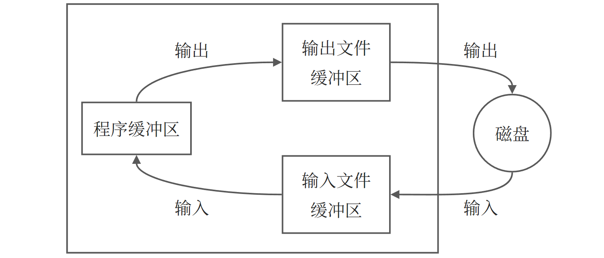

# 10 - 文件操作

## 1 C 文件基本知识

### 1.1 文件与文件分类

文件(flie)一般是指**存储在外部介质(如磁盘)上的数据的集合**。操作系统是以文件为单位对数据进行管理的。文件有不同类型，C 语言中主要用到两种文件：

1. **程序文件**：包括源程序文件 `.c`、目标文件 `.obj`、可执行文件 `.exe`。文件的内容是程序代码。
2. **数据文件**：文件的内容是供程序运行时读写的数据。

我们主要讨论的是数据文件。

C 语言把文件看作一个字符(或字节)的序列，即由一个一个字符(或字节)的数据顺序组成。一个输入输出流就是一个字符流或字节(内容为二进制数据)流。C 的数据文件由一连串的字符(或字节)组成，对文件的存取是以字符(字节)为单位的。输入输出数据流的开始和结束仅受程序控制而不受物理符号(如回车换行符)控制，这就增加了处理的灵活性。这种文件称为**流式文件**。

一个文件要有唯一的文件标识，以便区分和引用，这就是**文件名**。文件标识包括 3 部分：①文件路径；②文件名主干；③文件后缀。如：

```shell
D:\cProgram\temp\file1.dat
```

工具数据的组织形式，将数据文件分为 **ASCII 文件**和**二进制文件**。数据在内存中是以二进制形式存储的，如果不加转换地输出到外存，就是二进制文件，可以认为它就是存储在内存的数据的映像，所以也称之为**映像文件**(image file)。如果要求在外存上以 ASCII 代码形式存储，则需要在存储前进行转换。ASCII 文件又称文本文件(text file)，每一个字节存放一个字符的 ASCII 代码。

用 ASCII 码形式输出时字节与字符一一对应，一个字节代表一个字符，因而便于对字符进行逐个处理，也便于输出字符。但一般占存储空间较多，而且要花费转换时间(二进制形式与 ASCII 码间的转换)。用二进制形式输出数值，可以节省外存空间和转换时间，把内存中的存储单元中的内容原封不动地输出到磁盘(或其他外部介质)上，此时每一个字节并不一定代表一个字符。如果程序运行过程中有的中间数据需要保存在外部介质上，以便在需要时再输人到内存，一般用二进制文件比较方便。在事务管理中，常有大批数据存放在磁盘上，随时调人十算机进行查询或处理，然后又把修改过的信息再存回磁盘，这时也常用二进制文件。

### 1.2 文件缓冲区

ANSI C 标准采用“**缓冲文件系统**”处理数据文件，所谓缓冲文件系统是指系统自动地在内存区为程序中每一个正在使用的文件开辟一个文件缓冲区。从内存向磁盘输出数据必须先送到内存中的缓冲区，装满缓冲区后才一起送到磁盘去。如果从磁盘向计算机读入数据，则一次从磁盘文件将一批数据输人到内存缓冲区(充满缓冲区)，然后再从缓冲区逐个地将数据送到程序数据区(给程序变量)。这样做是为了节省存取时间，提高效率，缓冲区的大小由各个具体的 C 编译系统确定。



### 1.3 文件类型指针

缓冲文件系统中，关键的概念是“**文件类型指针**”，简称**文件指针**。每个被使用的文件都会在内存中开辟一个相应的文件信息区，用来存放文件的有关信息，这些信息是保存在一个系统声明的结构体变量 `FILE` 中。例如，一种 C 编译环境提供的 `stdio.h` 头文件中有以下文件类型声明：

```c
typedef struct {
    short level;            // 缓冲区“满”或“空”的长度
    unsigned flags;            // 文件状态标志
    char fd;                // 文件描述符
    unsigned char hold;        // 如缓冲区无内容不读取字符
    short bsize;            // 缓冲区大小
    unsigned char* buffer;    // 数据缓冲区的位置
    unsigned char* curp;    // 文件位置标记指针当前的指向
    unsigned istemp;        // 临时文件指示器
    short token;            // 用于有效检查
} FILE；
```

以上声明 FILE 结构体类型的信息包含在头文件 `stdio.h` 中。在程序中可以直接用 `FILE` 类型名定义变量。每一个 `FILE` 类型变量对应一个文件的信息区，在其中存放该文件的有关信息。例如：

```c
FILE fl；
```

以上定义了一个结构体变量 `f1`，用它来存放一个文件的有关信息。这些信息是在打开一个文件时由系统根据文件的情况自动放人的，在读写文件时需要用到这些信息，也会修改某些信息。例如在读一个字符后，文件信息区中的位置标记指针的指向就要改变。一般不定义 `FILE` 类型的变量命名，也就是不通过变量的名字来引用这些变量，而是设置一个指向 `FILE` 类型变量的指针变量，然后通过它来引用这些 `FILE` 类型变量。这样使用起来方便。如：

```c
FILE* fp;
```

定义 `fp` 是一个指向 `FILE` 类型数据的指针变量。可以使 `fp` 指向某一个文件的文件信息区(是一个结构体变量)，通过该文件信息区中的信息就能够访问该文件。

::: tip 注意
指向文件的指针变量并不是指向外部介质上的数据文件的开头，而是指向内存中文件信息区的开头。
:::

## 2 打开和关闭文件

文件读写之前要先打开，使用结束后要及时关闭。所谓“打开”是指为文件建立相应的休息区和文件缓冲区。编写程序时，打开文件的同时一般都指定一个指针变量指向该文件，通过指针变量对文件进行读写。所谓“关闭”就是撤销文件休息区和文件缓冲区，是指针变量不在指向该文件。

### 2.1 用 fopen 函数打开数据文件

ANSI C 规定用标准输入输出函数 `fopen` 来实现打开文件，其调用方式为：

```c
fopen(文件名, 使用文件方式);
```

`fopen` 函数的返回值是一个指向该文件的指针变量。如果打开出错，则返回空指针 `NULL`。如：

```c
FILE* fp;
fp = fopen("afile", "r");
```

使用文件方式包括：

| 文件使用方式 |                 含义                 | 如果指定文件不存在 |
| :----------: | :----------------------------------: | :----------------: |
|   `r` 只读   | 为了输入数据打开一个已存在的文本文件 |        出错        |
|   `w` 只写   |     为了输出数据打开一个文本文件     |     建立新文件     |
|   `a` 追加   |         向文本文件尾添加数据         |        出错        |
|  `rb` 只读   |    为了输入数据打开一个二进制文件    |        出错        |
|  `wb` 只写   |    为了输出数据打开一个二进制文件    |     建立新文件     |
|  `ab` 追加   |        向二进制文件尾添加数据        |        出错        |
|  `r+` 读写   |        为读写打开一个文本文件        |        出错        |
|  `w+` 读写   |      为读写建立一个新的文本文件      |     建立新文件     |
|  `a+` 读写   |        为读写打开一个文本文件        |        出错        |
|  `rb+` 读写  |       为读写打开一个二进制文件       |        出错        |
|  `wb+` 读写  |     为读写建立一个新的二进制文件     |     建立新文件     |
|  `ab+` 读写  |       为读写打开一个二进制文件       |        存储        |

### 2.2 用 fclose 函数关闭数据文件

`flose` 函数关闭文件的一般形式为：

```c
fclose(文件指针);
```

当成功执行了关闭操作，该函数返回值为 0，否则为 EOF(-1)。

## 3 顺序读写数据文件

### 3.1 向文件读写字符

C 语言提供两个函数对文本文件读写单个字符：

| 函数名  |    调用形式     |                功能                |                           返回值                            |
| :-----: | :-------------: | :--------------------------------: | :---------------------------------------------------------: |
| `fgetc` |   `fgetc(fp)`   |  从 `fp` 指向的文件读入有一个字符  |  读成功则返回所读字符，失败则返回文件结束标志 `EOF`(即 -1)  |
| `fputc` | `fputc(ch, fp)` | 把字符 `ch` 写到 `fp` 指向的文件中 | 输出成功则返回输出字符，失败则返回文件结束标志 `EOF`(即 -1) |

下面的例子实现了从键盘逐个输入字符并写入到磁盘文件中，知道输入一个 `#`：

```c
#include <bits/types/FILE.h>
#include <stdio.h>
#include <stdlib.h>

int main() {
    FILE* fp;                                  // 定义文件指针
    char ch, filename[10];
    scanf("%s", filename);                     // 输入文件名
    getchar();                                 // 消化回车符
    if ((fp = fopen(filename, "w")) == NULL) { // 打开文件
        printf("Can not open file!");
        exit(0);
    }
    ch = getchar();                            // 输入第一个字符
    while (ch != '#') {
        fputc(ch, fp);                         // 向磁盘文件按输出字符
        putchar(ch);
        ch = getchar();
    }
    fclose(fp);
    putchar(10);
    return 0;
}
```

在访问磁盘文件时，是逐个字符(字节)进行的，为了知道当前访问到第几个字节，系统用“文件读写位置标记”来表示当前所访问的位置。开始时“文件读写位置标记”指向第 1 个字节，每访问完一个字节后，当前读写位置就指向下一个字节，即当前读写位置自动后移。为了知道对文件的读写是否完成，只须看文件读写位置是否移到文件的末尾。文件尾表示用标识符 `EOF`(end of file)表示，`EOF` 在 `stdio.h` 中被定义为 -1。

用 `feof` 函数可以检测文件尾标志是否已被读取过。如果文件尾标志已被读出，则表示文件已结束，此时 `feof` 函数值为真(以 1 表示)，否则 `feof` 函数值为假(以 0 表示)。

### 3.2 向文件读写字符串

C 语言允许使用两个函数读写一个字符串：

| 函数名  |      调用形式       |                             功能                             |                  返回值                   |
| :-----: | :-----------------: | :----------------------------------------------------------: | :---------------------------------------: |
| `fgets` | `fgets(str, n, fp)` | 从 `fp` 指向的文件读入有一个长度为 n-1 的字符串，存放到字符数组 `str` 中 | 读成功则返回地址 `str`，失败则返回 `NULL` |
| `fputs` |  `fputs(str, fp)`   |        把 `str` 所指向的字符串写到 `fp` 指向的文件中         |    输出成功则返回 0，失败则返回非 0 值    |

下面的例子实现了从键盘读入若干个字符串，按照字母大小排序后保存到磁盘文件中：

```c
#include <bits/types/FILE.h>
#include <stdio.h>
#include <stdlib.h>
#include <string.h>

int main() {
    FILE* fp;
    char str[3][10], temp[10];
    int i, j, k, n = 3;
    for (i = 0; i < n; i++)
        scanf("%s", str[i]);
    for (i = 0; i < n - 1; i++) {
        k = i;
        for (j = i + 1; j < n; j++) {
            if (strcmp(str[k], str[j]) > 0)
                k = j;
        }
        if (k != i) {
            strcpy(temp, str[i]);
            strcpy(str[i], str[k]);
            strcpy(str[k], temp);
        }
    }
    if((fp=fopen("file.txt", "w"))==NULL) {
        printf("Can not open file!");
        exit(0);
    }
    for(i=0;i<n;i++){
        fputs(str[i], fp);
        fputs("\n", fp);
        printf("%s\n", str[i]);
    }
    return 0;
}
```

### 3.3 格式化读取文本文件

使用 `fprintf` 和 `fscanf` 函数可以实现对文件的格式化输入输出：

```c
fprintf(文件指针, 格式化字符串, 输出表列);
fscanf(文件指针, 格式化字符串, 输入表列);
```

如：

```c
fprintf(fp, "%d, %6.2f", i, f);
fscanf(fp, "%d, %f", &i, &f);
```

用这两个函数对磁盘文件读写，使用方便，易于理解，但由于在输入时要将文件中的 ASCII 码转换为二进制形式再保存在内存变量中，在输出时又要将内存中的二进制形式转换成字符，要花费较多时间。因此，在内存与磁盘频繁交换数据的情况下，最好不用 `fprintf` 和 `fscanf` 函数，而用下面的 `fread` 和 `fwrite` 函数进行二进制的读写。

### 3.4 二进制方式读写数据

在程序中常需要一次输入输出一组数据(如数组或结构体变量的值)，C 语言使用 `fread` 函数从文件中读取一个数据块，用 `fwrite` 函数向文件写一个数据块。在读写时是以二进制形式进行的，因此操作的文件需以二进制形式打开。它们的一般形式为：

```c
fread(buffer, size, count, fp);
fwrite(buffer, size, count, fp);
```

其中：

- `buffer`：地址。对 `fread` 来说是用来存放从文件读入的数据的存储地址；对 `fwrite` 来说是把该地址开始的存储区中的数据向文件输出。
- `size`：要读写的字节数。
- `count` ：要读写的数据项的个数，每个数据项长度为 `size`。
- `fp`：`FILE` 类型的指针。

下面的例子实现了从键盘上输入 10 组数组并转存到磁盘文件上：

```c
#include <stdio.h>
#define SIZE 10
struct Student {
    char name[10];
    int num;
    int age;
} stud[SIZE];

void save() {
    FILE* fp;
    int i;
    if ((fp = fopen("stu.dat", "wb")) == NULL) {
        printf("Can not open file!\n");
        return;
    }
    for (i = 0; i < SIZE; i++) {
        if (fwrite(&stud[i], sizeof(struct Student), 1, fp) != 1)
            printf("File write error!\n");
    }
    fclose(fp);
}

int main() {
    int i;
    for (i = 0; i < SIZE; i++)
        scanf("%s %d %d", stud[i].name, &stud[i].num, &stud[i].age);
    save();
    return 0;
}
```

## 4 随机读写数据文件

随机访问不是按数据在文件中的物理位置次序进行读写，而是可以对任何位置上的数据进行访问，显然这种方法比顺序访问效率高得多。

系统为每一个文件设置了一个文件读写位置标记，用来指示接下来要读写的字符的位置。如果是顺序写文件，则每写完一个数据后，文件位置标记顺序向后移一个位置，然后在下一次执行写操作时把数据写人位置标记所指的位置。直到把全部数据写完，此时文件位置标记在最后一个数据之后。

可以根据读写的需要，人为地移动文件位置标记的位置。文件位置标记可以向前移、向后移，然后对该位置进行读写。从而实现在任何位置写人数据，在任何位置读取数据。

强制文件位置标记指向特定位置，可以使用以下函数实现：

1. 用 `rewind` 函数使文件位置标记指向文件开头，此函数无返回值。

2. 用 `fseek` 函数改变文件位置标记，其调用形式为：

   ```c
   fseek(文件类型指针, 位移量, 起始点);
   ```

   “起始点”用 0，1 或 2 代替，0 代表文件开始位置，1 为当前位置，2 为文件末尾位置。C 标准指定的名字如下表：

   |    起始点    |   名字   | 用数字代表 |
   | :----------: | :------: | :--------: |
   | 文件开始位置 | SEEK_SET |     0      |
   | 文件当前位置 | SEEK_CUR |     1      |
   | 文件末尾位置 | SEEK_END |     2      |

   “位移量”是指以“起始点”为基点，向前移动的字节数，应是一个 `long` 型数据。该函数一般用于二进制文件。

3. 用 `ftell` 函数测定文件位置标记当前的位置，用相对于文件开头的位移量来表示。如果调用函数时出错，则返回 `-1L`。

## 5 文件读写的出错检测

C 提供一些函数来检查输入输出函数调用时可能出现的错误：

1. `ferror` 函数：在调用各种输入输出函数(如 `putc`，`getc`，`fread` 和 `fwrite` 等)时，如果出现错误，除了函数返回值有所反映外，还可以用 `ferror` 函数检查。它的一般调用形式为：

   ```c
   ferror(fp);
   ```

   如果返回值为 0(假)，表示未出错；如果返回一个非零值，表示出错。对同一个文件每一次调用输入输出函数，都会产生一个新的 `ferror` 函数值，因此，应当在调用一个输入输出函数后立即检查 `ferror` 函数的值，否则信息会丢失。在执行 `fopen` 函数时，`ferror` 函数的初始值自动置为 0。

2. `clearerr` 函数：该函数作用是使文件出错标志和文件结束标志置为 0。假设在调用一个输入输出函数时发生错误，`ferror` 函数的值为一个非零值。应该立即调用 `clearerr(fp)` 使 `clearerr(fp)` 值变为 0，以便再进行下一次的检测。只要出现文件读写出错标志，它就一直保留，直到对同一文件调用 `clearerr` 函数或 `rewind` 函数，或任何其他一个输入输出函数。
