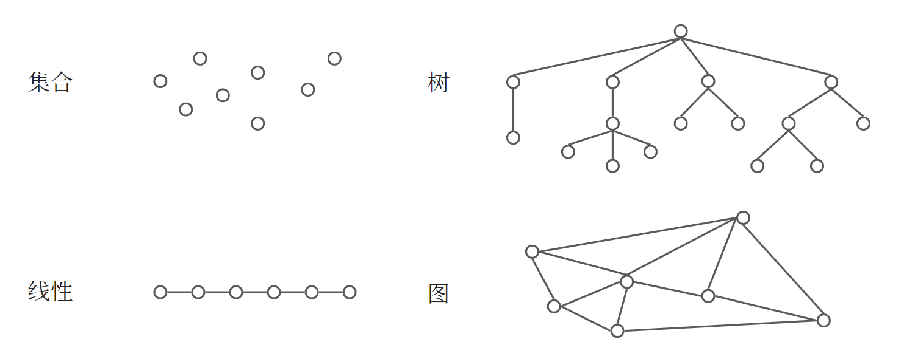

---
head:
  - - link
    - rel: stylesheet
      href: https://cdnjs.cloudflare.com/ajax/libs/KaTeX/0.5.1/katex.min.css
---

# 01 - 数据结构导论

## 1 什么是数据结构

### 1.1 数据结构基本概念

**数据(data)** 是对客观事物的符号表示，在计算科学中是指所有能输入到计算机中并被计算机程序处理的符号的总称问题。图像、声音等都可以通过编码从而归入到数据的范畴。

**数据元素(data element)** 是数据的基本单位，在计算机中通过作为一个整体进行考虑和处理。一个数据元素可以由若干个数据项(data item)组成。

**数据对象(data object)** 是性质相同的数据元素的集合，是数据的一个子集。

**数据结构(data structure)** 是相互之间存在一种或多种特定关系的数据元素的集合。从学科角度，数据结构是一门研究非数值计算的程序设计问题中计算机的操作对象以及它们之间的关系和操作等的学科。

在任何问题中，数据元素都不是孤立存在的，而是在他们之间存在某种关系，这种数据元素之间的关系称为**结构(structure)**。根据数据元素之间关系的不同特性，通常有以下 4 种基本结构：

1. **集合**：结构中的数据元素除了同属一个集合的关系外，无其他关系。
2. **线性结构**：结构中的数据元素之间存在一个对一个的关系。
3. **树形结构**：结构中的数据元素之间存在一个对多个的关系。
4. **图状结构**或**网状结构**：结构中的数据元素之间存在多个对多个的关系。



### 1.2 数据结构的形式定义

::: tip 数据结构的形式定义
数据结构是一个二元组：
$$
Data\_ Structure = (D, S)
$$
其中，$D$ 是数据元素的集合，$S$ 是 $D$ 上关系的有限集。
:::

例如，复数是一种数据结构：

$$
Complex = (C, R)
$$

其中，$C$ 是两个实数的集合 ${c1, c2}$，$R={P}$，而 $P$ 是定义在集合 $C$ 上的一张关系 ${<c1, c2>}$，其中有序偶 $<c1, c2>$ 表示 $c1$ 是复数的实部，$c2$ 是复数的虚部。

结构定义中的“关系”描述的是数据元素之间的逻辑关系，因此又称为数据的**逻辑结构**。

### 1.3 数据结构的计算机表示

数据结构在计算机中的表示(又称映像)称为数据的**物理结构**，又称**存储结构**，它包括数据元素的表示和关系的表示。计算机中表示信息的最小单位是二进制的**位(bit)**，可以用若干个位组合起来形成一个位串表示一个数据元素(如用 8 位二进制表示一个字符)，通常称这个位串为**元素(element)**或**结点(node)**。当数据元素由若干个数据项组成时，位串中对应于各个数据项的子位串称为**数据域(data field)**。因此，元素或结点可以看做数据元素在计算机中的映射。

数据元素之间的关系在计算机中有两种不同的表示方法：

1. **顺序映像**：借助元素在存储器中的相对位置来表示元素之间的逻辑关系。
2. **非顺序映像**：借助指示元素存储地址的指针表示元素之间的逻辑关系。

由此得到两种不同的存储结构：**顺序存储结构**和**链式存储结构**。

::: tip 注意
任何一个算法的设计取决于选定的数据(逻辑)结构，而算法的实现依赖于采用的存储结构。
:::

存储结构涉及数据元素及其关系在存储器中的物理位置，从高级程序语言的角度，可以借用高级程序语言中提供的“数据类型”来描述它，例如，可以使用一维数组来描述顺序存储结构，用 C 语言提供的指针来描述联赛存储结构。

### 1.4 数据类型、抽象数据类型和多形数据类型

**数据类型(data type)** 是一个值的集合和定义在这个值集上的一组操作的总称，是一个和数据结构密切相关的概念，最早出现在高级编程语言中，用来刻画(程序)操作对象的特性。按“值”的不同特性，高级程序语言中的数据类型可分为两类：

1. **原子型**：非结构的，不可拆解的，如 C 语言中的基本类型(整型、实型、字符型、枚举类型)、指针类型和空类型。
2. **结构类型**：由若干个成分按某种结构组成，是可分解的，其成分可以是非结构的，也可以是结构的，如数组。

**抽象数据类型(abstract data type，简称 ADT)** 是指一个数学模型以及定义在该模型上的一组操作抽象数据类型的定义仍取决于它的一组逻辑特性，而与其在计算机内部如何表示和实现无关，无论其内部结构如何变化，只要它的数学特性不变，都不影响其外部使用。

抽象数据类型和数据类型实际上是一个概念，“抽象”的意义在于数据类型的数学抽象特性。另一方面，抽象数据类型的范畴更广，它不再局限于各处理器中已定义并实现的数据类型(固有数据类型)，还包括用户在设计软件系统时自己定义的数据类型。

::: tip 注意
一个软件系统的框架应建立的数据之上，而不是建立在操作之上。
:::

一个含抽象数据类型的软件模块通常应包含定义、表示和实现 3 个部分。抽象数据类型的定义由一个值域和定义在该值域上的一组操作组成。若按其值的不同特性，可细分为 3 种类型：

1. **原子类型(atomic data type)**：属于该类型的变量的值不可分解，一般情况下已有的固有数据类型足以满足需求，较少用。
2. **固定聚合类型(fixed-aggregate data type)**：属于该类型的变量的值由确定数目的成分按照某种结构组成。如复数由连个实数依确定的次序组成。
3. **可变聚合类型(variable-aggregate data type)**：和固定聚合类型比较，构成可变聚合类型的值的成分数目不确定。例如长度可变的有序整数序列。

后两种类型统称为结构类型。

和数据结构的形式定义相对应，抽象数据类型可用以下三元组表示：

$$
(D, S, P)
$$

其中，$D$ 是数据对象，$S$ 是 $D$ 上的关系集，$P$ 是对 $D$ 的基本操作集。

往后的介绍默认使用下面的格式定义抽象数据类型：

```c
ADT 抽象数据类型名 {
    数据对象: <数据对象的定义>
    数据关系: <数据关系的定义>
    基本操作: <基本操作的定义>
} ADT 抽象数据类型名
```

其中，数据对象和数据关系的定义用伪代码描述，基本操作的定义格式为：

```c
基本操作名(参数表)
    初始条件: <初始条件描述>
    操作结果: <操作结果描述>
```

基本操作有两种参数：

1. 赋值参数：只为操作提供输入值。
2. 引用参数：一 `&` 开头，除可提供输入值外，还将返回操作结果。

“初始条件”描述了操作执行之前数据结构和参数应满足的条件，若不满足，则操作失败并返回相应出错信息。“操作结果”说明了操作正常完成之后数据结构的变化状况和应返回的结果。若初始条件为空，则省略。

下面定义一个抽象数据类型三元组：

```c
ADT Triplet {
    数据对象: D = {e1, e2, e3 | e1, e2, e3 ∈ ElemSet}
    数据关系: R1 = {<e1, e2>, <e2, e3>}
    基本操作:
        InitTriplet(&T, v1, v2, v3)
            操作结果: 构造三元组 T，元素 v1，v2，v3 分别赋值给 e1，e2，e3
        Get(T, i, &e)
            初始条件: 三元组 T 已存在
            操作结果: 用 e 返回 T 的第 i 元的值
        Max(T, &e)
            初始条件: 三元组 T 已存在
            操作结果: 用 e 返回 T 的三个元素中的最大值
} ADT Triplet
```

**多形数据类型(polymorphic data type)** 是指其值的成分不确定的数据类型。例如上面定义的抽象数据类型 Triplet，其元素 e1、e2、e3 可以是整数、字符或字符串，甚至是更复杂地由多种成分组成(只要能进行关系运算即可)。无论其元素具有何种特性，元素之间的关系相同，基本操作相同。从抽象数据类型的角度看，具有相同的抽象特性，因此称为多形数据类型。显然，多形数据类型需要借助面向对象的程序设计语言来实现，这里默认使用类 C 语言作为描述工具，故只讨论含有确定成分的数据元素的情况，如上面例子中的 ElemSet。

## 2 抽象数据类型的表示与实现

抽象数据类型可通过固有数据类型来表示和实现。这里采用类 C 语言作为描述语言，并进行了适当的扩充修改。简要说明如下：

1. 预定义常量和类型：
   ```c
   // 函数结果状态代码
   #define TRUE         1
   #define FALSE        0
   #define OK           1
   #define ERROR        0
   #define INFEASIBLE   -1
   #define OVEFLOW      -2
   // Status 时函数类型，其值时函数结果状态代码
   typedef int Status;
   ```
2. 数据结构的表示(存储结构)用类型定义 `typedef` 描述，数据元素类型约定为 ElemType，由用户在使用该数据时自行定义。
3. 基本操作的算法用以下形式的函数描述：
   ```c
   函数类型 函数名(函数参数表) {
       // 算法说明
       语句序列
   } // 函数名
   ```
   除了函数参数需要说明类型外，算法中使用的辅助变量可以不作变量声明，必要时对其作注释说明。一般 a、b、c、d、e 等用作数据元素名，i、j、k、l、m、n 等用作整型变量名，q、p、r 等用作指针变量名。当函数返回值为函数结果状态代码时，函数定义用 `Status` 类型名。除了值调用方式外，增加了 C++ 语言的引用调用的参数传递方式，在形参表列中，以 `&` 开头的参数即为引用参数。
4. 赋值语句有：
   ```c
   简单赋值     变量名 = 表达式;
   串联赋值     变量名1 = 变量名2 = ... = 变量名k = 表达式;
   成组赋值     (变量名1, ..., 变量名k) = (表达式1, ... , 表达式k);
               结构名 = 结构名;
               结构名 = (值1, ... , 值k);
               变量名[] = 表达式;
               变量名[起始下标..终止下标] = 变量名[起始下标..终止下标];
   交换赋值     变量名 <-> 变量名;
   条件赋值     变量名 = 条件表达式 ? 表达式T : 表达式F;
   ```
5. 选择语句有：
   ```c
   条件语句1    if(表达式) 语句;
   条件语句2    if(表达式) 语句;
               else 语句;
   开关语句1    switch(表达式) {
                   case 值1: 语句序列1; break;
                   ...
                   case 值n: 语句序列n; break;
                   default: 语句序列n+1;
               }
   开关语句2    switch {
                   case 条件1: 语句序列1; break;
                   ...
                   case 条件n: 语句序列n; break;
                   default 语句序列n+1;
               }
   ```
6. 循环语句有：
   ```c
   for语句      for(赋值表达式序列; 条件; 修改表达式序列) 语句;
   while语句    while(条件) 语句;
   do-while语句 do {
                   语句序列; 
               } while(条件);
   ```
7. 结束语句有：
   ```c
   函数结束语句     return 表达式;
                  return;
   case结束语句     break;
   异常处理语句     exit(异常代码);
   ```
8. 输入输出语句有：
   ```c
   输入语句     scanf([格式串], 变量1, ..., 变量n);
   输出语句     printf([格式串], 表达式1, ..., 表达式n);
   ```
9. 注释：
    ```c
    单行注释    // 文字序列
    ```
10. 基本函数有：
    ```c
    求最大值        max(表达式1, ..., 表达式n)
    求最小值        min(表达式1, ..., 表达式n)
    求绝对值        abs(表达式)
    求不足整数值    floor(表达式)
    求进位整数值    ceil(表达式)
    判定文件结束    eof(文件变量) 或 eof
    判定行结束      eoln(文件变量) 或 eoln
    ```
11. 逻辑运算约定：
    ```c
    与运算      &&
    或运算      ||
    ```

以抽象数据类型 Triplet 的表示和实现为例：

```c
// 采用动态分配的顺序存储结构
typedef ElemType * Triplet;  // 由 InitTriplet 分配 3 个元素存储空间

// 基本操作的函数原型说明
Status InitTriplet(Triplet &T, ElemType v1, ElemType v2, ElemType v3);
    // 操作结果：构造三元组 T，元素 v1，v2 和 v3 分别赋值给 e1，e2，e3
Status Get(Triplet T, int i, ElemType &e);
    // 初始条件：三元组 T 已存在，1≤i≤3
    // 操作结果：用 e 返回 T 的第 i 元的值
Status Max(Triplet T, ElemType &e)
    // 初始条件：三元组 T 已存在
    // 操作结果：用 e 返回 T 三个元素中的最大值

// 基本操作的实现
Status InitTriplet(Triplet &T, ElemType v1, ElemType v2, ElemType v3) {
    // 构造三元组 T
    T = (ElemType *) malloc (3 * sizeof(ElemType));     // 分配 3 个元素的存储空间
    if(!T) exit(OVERFLOW);                              // 分配存储空间失败
    T[0] = v1;  T[1] = v2;  T[2] = v3;
    return OK;
} // InitTriplet
Status Get(Triplet T, int i, ElemType &e) {
    // 1≤i≤3，用 e 返回 T 的第 i 元的值
    if(i<1 || i>3) return ERROR;
    e = T[i-1];
    return OK;
} // Get
Status Max(Triplet T, ElemType &e) {
    // 用 e 返回 T 中最大元素的值
    e = (T[0]>=T[1]) ? ((T[0]>=T[2]) ? T[0]:T[2]) : ((T[1]>=T[2]) ? T[1]:T[2])
    return OK;
} // Max
```

## 3 算法和算法分析

### 3.1 算法

**算法(algorithm)** 是对特定问题求解步骤的一种描述，它是指令的有限序列，其中每一条指令表示一个或多个操作。此外，一个算法还具有下列 5 个重要特性：

1. **有穷性**：一个算法必须总是(对任何合法的输入值)在执行有穷步之后结束，且每一步都可在有穷时间内完成。
2. **确定性**：算法中每一条指令必须有确切的含义，读者理解时不会产生二义性。并且，在任何条件下，算法只有惟一的一条执行路径，即对于相同的输入只能得出相同的输出。
3. **可行性**：一个算法是能行的，即算法中描述的操作都是可以通过已经实现的基本运算执行有限次来实现的。
4. **输入**：一个算法有零个或多个的输入，这些输入取自于某个特定的对象的集合。
5. **输出**：一个算法有一个或多个的输出，这些输出是同输入有着某些特定关系的量。

### 3.2 算法设计的要求

一个好的算法应考虑达到以下目标：

1. **正确性**：算法要满足具体问题的要求。
2. **可读性**：便于理解、调试和修改。
3. **健壮性**：当输入非法数据时能够做出适当的反应或处理，而不是参数不合理的输出结果。
4. **效率与低存储量需求**：效率涉及程序运行时间，低储存量涉及程序运行时所需要的最大存储空间。

### 3.3 算法效率的度量

度量一个程序的运行时间通常有两种方法：

1. 事后统计：利用计算机内部的计时功能，不同的算法程序可通过一组或若干组相同的统计数据以分辨优劣。
   缺陷：必须先运行依据算法编制的程序；所得时间的统计量依赖于计算机的软件、硬件等环境因素，有时容易掩盖算法本身优劣。
2. 事前分析估算：一个用高级程序语言编写的程序在计算机上运行所消耗的时间取决于以下因素：
   - 依据的算法选用的策略；
   - 问题的规模；
   - 书写程序的语言：语言级别越高，执行效率越低；
   - 编译程序所产生的的机器代码的质量；
   - 机器执行指令的速度。

由此，使用绝对时间衡量算法的效率是不合适的。抛开计算机软件、硬件因素，可认为**一个特定算法的效率只依赖于问题的规模(通常用整数 n 表示)**，或者说，它是问题规模的函数。

一个算法由控制结构和原操作(固有数据类型的操作)构成，算法时间取决于两者的综合效果。为了便于比较同一问题的不同算法，通常的做法是：**从算法中选取一种对所研究的问题(或算法类型)来说是基本操作的原操作，以该基本操作重复执行的次数作为算法的时间量度。**

::: tip 时间复杂度
一般情况下，算法中基本操作重复执行的次数是问题规模 $n$ 的某个函数 $f(n)$，算法的时间量度记作：
$$
T(n) = O(f(n))
$$
它表示随问题规模 $n$ 的增大，算法执行时间的增长率和 $f(n)$ 的增长率相同，称为算法的**渐近时间复杂度(asymptotic time complexity)**，简称**时间复杂度**。
::: details $O$ 的形式定义：
若 $f(n)$ 是正整数 $n$ 的一个函数，则 $x_n=O(f(n))$ 表示存在一个正的常数 $M$，使得当 $n\ge n_0$ 时都满足 $\left|x_n\right| \le \left| M(f(n))\right|$。
:::

显然，被称做问题的基本操作的原操作应是其重复执行次数和算法的执行时间成正比的原操作，多数情况下它是最深层循环内的语句中的原操作，它的执行次数和包含它的语句的频度相同。语句的 **频度(frequency count)** 指的是该语句重复执行的次数。

例如，两个 $N\times N$ 矩阵相乘的算法：

```c
for(i=1; i<=n; ++i)
    for(j=1; j<=n; ++j) {
        c[i][j] = 0;
        for(k=1; k<=n; ++k)
            c[i][j] += a[i][k] * b[k][j];
    }
```

其中，乘法运算是矩阵相乘问题的基本操作，整个算法的执行时间与该基本操作的重复执行次数 $n^3$ 成正比，记作 $T(n) = O(n^3)$。

常见的时间复杂度如 $O(1)$、$O(n)$、$O(n^2)$ 等分别称为常量阶、线性阶、平方阶，此外还有对数阶 $O(\log n)$、指数阶 $O(2^n)$ 等。考虑到不同数量级的复杂度性状，**应尽可能地选用多项式阶 $O(n^k)$ 的算法，而不是使用指数阶的算法。**

一般情况下，对一个问题(或一类算法)只需选择一种基本操作来讨论算法的时间复杂度即可，有时也需要考虑几种基本操作，甚至可以对不同的操作赋予不同的权值。

由于算法的时间复杂度只考虑问题规模 $n$ 的增长率，因此，在难以精确计算基本操作的执行次数(或语句的频度)的情况下，只需**求出它关于 $n$ 的增长率或阶**即可。如下面的程序：

```c
for(i=2; i<=n; ++i)
    for(j=2; j<=i-1; ++j) {
        ++x;
        a[i][j] = x;
    }
```

语句 `++x` 的执行次数关于 $n$ 的增长率为 $n^2$，它是语句频度表达式 $(n-1)(n-2)/2$ 中增长最快的项。

有的情况下，算法中基本操作的重复执行次数还随输入的数据集的不同而不同，如起泡排序算法：

```c
void bubble_sort(int a[], int n) {
    // 将 a 中整数序列由小到大重新排列
    for(i=n-1,change=TRUE; i>=1&&change; --i) {
        change = FALSE;
        for(j=0; j<i; ++j) {
            if(a[j] > a[j+1]) {
                a[j] <-> a[j+1];
                change = TRUE;
            }
        }
    }
} // bubble_sort
```

上面程序中的基本操作为 `a[j]<->a[j+1]`，当 a 的初始序列为由小到大排列时，基本操作执行次数为 0，当 a 初始序列为由大到小排列时，基本操作执行次数为 $n(n-1)/2$。对这类算法的分析，有两种解决方法：

1. 考虑所有可能输入数据集的期望值，此时相应的时间复杂度为算法的**平均时间复杂度**。
2. 讨论算法在最坏情况下的时间复杂度，即估算算法执行时间的上界。

假设 a 初始输入数据可能出现 $n!$ 种排列情况的概率相等，则起泡排序额算法的时间复杂度为 $T_{arg}(n)=O(n^2)$。起泡排序算法的最坏情况为 a 中初始序列为由大到小排列，则起泡排序算法在最坏情况下的时间复杂度为 $T(n)=O(n^2)$。

很多情况下各种输入数据出现的概率难以确定，因此通常第二种方法更加可行。往后讨论的时间复杂度均默认为最坏情况下的时间复杂度。

### 3.4 算法的存储空间需求

类似于算法的时间复杂度，以 **空间复杂度(space complexity)** 作为算法所需存储空间的量度：

::: tip 空间复杂度
$$
S(n) = O(f(n))
$$
其中，$n$ 为问题的规模。
:::

一个上机执行的程序除了需要存储空间来寄存本身所用指令、常数、变量和输入数据外，也需要一些对数据进行操作的工作单元和存储一些为实现计算所需信息的辅助空间。若输入数据所占空间只取决于问题本身，和算法无关，则只需要分析除输入和程序之外的额外空间，否则应同时考虑输入本身所需空间(和输入数据的表示形式有关)。若额外空间相对于输入数据量来说是常数，则称此算法为原地工作。如果所占空间量依赖于特定的输入，则除特别指明外，均按最坏情况来分析。
