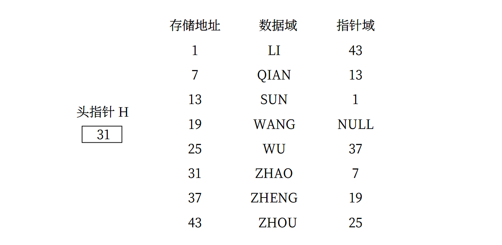

---
head:
  - - link
    - rel: stylesheet
      href: https://cdnjs.cloudflare.com/ajax/libs/KaTeX/0.5.1/katex.min.css
---

# 02 - 线性表

线性结构的特点：在数据元素的非空有限集合中，

- 存在唯一一个被称作“第一个”的数据元素；
- 存在唯一一个被称作“最后一个”的数据元素；
- 除第一个外，集合中每一个数据元素都只有一个前驱；
- 除最后一个外，集合中每一个元素都只有一个后继。

## 1 线性表的类型定义

**线性表(linear_list)**是 $n$ 个数据元素的有限序列，是最常见和最简单的一种数据结构。在稍复杂的线性表中，一个数据元素可以由若干个**数据项(item)**组成。在这种情况下，常把数据元素称为**记录(record)**，含有大量记录的线性表称为**文件(file)**。

线性表中的数据元素可以是多种多样的，但同一线性表中的元素必定具有相同的特性，即属于同一数据对象，相邻数据元素之间存在序偶关系。若将线性表记为：

$$
(a_1,\cdots,a_{i-1},a_i,a_{i+1},\cdots,a_n)
$$

则表中 $a_{i-1}$ 是 $a_i$ 的直接前驱元素， $a_{i+1}$ 是 $a_i$ 的直接后继元素。
线性表中元素的个数 $n(n \ge 0)$ 定义为线性表的长度， $n=0$ 是为空表。非空表中的每个数据元素都有一个确定的位置， $i$ 为数据元素 $a_i$ 在线性表中的位序。

线性表很灵活，其长度可以根据需要调整，即对线性表的数据元素可以进行访问、插入、删除等。

抽象数据类型线性表的定义如下：

```c
ADT List {
    数据对象: D = {ai | ai ∈ ElemSet, i = 1,2,...,n, n≥0}
    数据关系: R1 = {<a{i-1},ai> | a{i-1},ai ∈ D, i=2,...,n}
    基本操作:
          InitList(&L)
            操作结果: 构造一个空的线性表 L
        DestroyList(&L)
            初始条件: 线性表 L 已存在
            操作结果: 销毁线性表 L
        ClearList(&L)
            初始条件: 线性表L已存在
            操作结果: 将L重置为空表
        ListEmpty(L)
            初始条件: 线性表 L 已存在
            操作结果: 若 L 为空表，则返回 TRUE，否则返回 FALSE
        ListLenght(L)
            初始条件: 线性表 L 已存在
            操作结果: 返回 L 中数据元素个数
        GetElem(L, i, &e)
            初始条件: 线性表 L 已存在，1≤i≤ListLength(L)
            操作结果: 用 e 返回 L 中第 i 个数据元素的值
        LocatElem(L, e, compare())
            初始条件: 线性表 L 已存在，compare() 是数据元素判定函数
            操作结果: 返回 L 中第 1 个与 e 满足关系 compare() 的数据元素的位序，若这样的数据元素不存在，则返回值为 0
        riorElem(L, cur_e, &pre_e)
            初始条件: 线性表 L 已存在
            操作结果: 若 cur_e 是 L 的数据元素，且不是第一个，则用 pre_e 返回它的前驱，否则操作失败，pre_e 无定义
        NextElelem(L, cur-e, &next-e)
            初始条件: 线性表 L 已存在
            操作结果: 若 cur_e 是 L 的数据元素，且不是最后一个，则用 next_e 返回它的后继，否则操作失败，next_e 无定义
        ListInsert(&L, i, e)
            初始条件: 线性表 L 已存在，1≤i≤ListLength(L)+1
            操作结果: 在 L 中第 i 个位置之前插入新的数据元素e，L 的长度加 1
        ListDelet(&L, i, &e)
            初始条件: 线性表 L 已存在且非空，1≤i≤ListLength(L)
            操作结果: 删除 L 的第 i 个数据元素，并用 e 返回其值，L 的长度减 1
        ListTraverse(L, visit())
            初始条件: 线性表 L 已存在
            操作结果: 依次对 L 的每个数据元素调用函数 visit()，一旦 visit() 失败，则操作失败
} ADT List
```

## 2 线性表的顺序表示与实现

线性表的顺序表示指的是用一组地址连续的存储单元依次存储线性表的数据元素。

假设线性表的每个元素需占用 1 个存储单元，并以所占的第一个单元的存储地址作为数据元素的存储位置。则线性表中第 $i+1$ 个数据元素的存储位置 $LOC(a_{i+1})$ 和第 $i$ 个数据元素的存储位置 $LOC(a_i)$ 之间满足下列关系：

$$
LOC(a_{i+1}) = LOC(a_i) + l
$$

一般来说，线性表的第 $i$ 个数据元素 $a_i$ 的存储位置为：

$$
LOC(a_i) = LOC(a_1) + (i-1) \times l
$$

$LOC(a_i)$ 是线性表的起始位置或称为基地址。

线性表的这种机内表示称做线性表的顺序存储结构或顺序映像(sequential mapping)，通常，称这种存储结构的线性表为顺序表。它的特点是，为表中相邻的元素 $a_i$ 和 $a_{i+1}$ 赋以相邻的存储位置 $LOC(a_i)$ 和 $LOC(a_{i+1})$。换句话说，以元素在计算机内“物理位置相邻”来表示线性表中数据元素之间的逻辑关系。每一个数据元素的存储位置都和线性表的起始位置相差一个和数据元素在线性表中的位序成正比的常数。由此，只要确定了存储线性表的起始位置，线性表中任一数据元素都可随机存取，所以线性表的顺序存储结构是一种随机存取的存储结构。

在顺序存储结构中的线性表中插入或删除一个数据元素，平均约移动表中一半的元素。若表长为 $n$，则其时间复杂度为 $O(n)$。

## 3 线性表的链式表示和实现

线性表的顺序存储结构的特点使得表中任一元素的存储位置可用一个简单、直观的公式来表示。然而，这个特点也铸成了这种存储结构的弱点：在作插入或删除操作时，需移动大量元素。而线性表的另一种表示方法——链式存储结构，不要求逻辑上相邻的元素在物理位置上也相邻，因此它没有顺序存储结构所具有的弱点，但同时也失去了顺序表可随机存取的优点。

### 3.1 线性链表

线性表的链式存储结构的特点是用一组**任意**的存储单元存储线性表的数据元素(这组存储单元可以是连续的，也可以是不连续的)。因此，为了表示每个数据元素 $a_i$ 与其直接后继数据元素 $a_{i+1}$ 之间的逻辑关系，对数据元素 $a_i$ 来说，除了存储其本身的信息之外，还需存储一个指示其直接后继的信息(即直接后继的存储位置)。这两部分信息组成数据元素 $a_i$ 的存储映像，称为**结点(node)**。它包括两个域：

- 存储数据元素信息的域称为**数据域**；
- 存储直接后继存储位置的域称为**指针域**。

指针域中存储的信息称做**指针**或**链**。$n$ 个结点($a_i(1\le i\le n)$的存储映像)链结成一个**链表**，即为线性表

$$
(a_1, a_2, \cdots a_n)
$$

的**链式存储结构**。又由于此链表的每个结点中只包含一个指针域，故又称**线性链表**或**单链表**。

下图所示为线性表

$$
(ZHAO,QIAN,SUN,LI,ZHOU,WU,ZHENG,WANG)
$$

的线性链表存储结构，整个链表的存取必须从**头指针**开始进行，头指针指示链表中第一个结点(即第一个数据元素的存储映像)的存储位置。同时，由于最后一个数据元素没有直接后继，则线性链表中最后一个结点的指针为“空”(NULL)。



单链表可由头指针唯一确定，在 C 语言中可用结构指针来描述。

```c
// 线性表的单链表存储结构
typefed struct LNode {
    ElemType data;
    struct LNode * next;
} LNode, * LinkList;
```

假设 L 是 LinkList 型的变量，则 L 为单链表的头指针，它指向表中第一个结点。若 L 为“空”(L=NULL)，则所表示的线性表为“空”表，其长度 $n$ 为“零”。有时，我们在单链表的第一个结点之前附设一个结点，称之为**头结点**。头结点的数据域可以不存储任何信息，也可存储如线性表的长度等类的附加信息，头结点的指针域存储指向第一个结点的指针(即第一个元素结点的存储位置)。此时，单链表的头指针指向头结点。若线性表为空表，则头结点的指针域为“空”。

在单链表中，由于任何两个元素的存储位置之间没有固定的联系，因此取得第 $i$ 个元素必须从头指针出发寻找。因此，单链表是非随机存取的存储结构。

### 3.2 循环链表

**循环链表**（circular linked list）是另一种形式的链式存储结构。它的特点是表中最后一个结点的指针域指向头结点，整个链表形成一个环。由此，从表中任一结点出发均可找到表中其他结点。类似地，还可以有多重链的循环链表。

### 3.3 双向链表

以上讨论的链式存储结构的结点中只有一个指示直接后继的指针域，由此，从某个结点出发只能顺指针往后寻查其他结点。若要寻查结点的直接前趋，则需从表头指针出发。也即是，在单链表中，NextElem 的执行时间为 $O(1)$，而 PriorElem 的执行时间为 $O(n)$。为克服单链表这种单向性的缺点，可利用**双向链表**（double linked list）。

在双向链表的结点中有两个指针域，其一指向直接后继，另一指向直接前趋，在 C 语言中可描述如下：

```c
// 线性链表的双向链表存储结构
typedef struct DuLNode {
    ElemType data;
    struct DuLNode * prior;
    struct DuLNode * next;
} DuLNode, * DuLinkList;
```

## 4 一元多项式的表示及相加

数学上，一个一元多项式 $P_n(x)$ 可按升幂写成：

$$
P_n(x) = p_0+p_1x+p_2x^2+\cdots+p_nx^n
$$

它由 $n+1$ 个系数唯一确定。因此，计算机里可以用一个线性表 $P$ 来表示：

$$
P = (p_0,p_1,p_2,\cdots,p_n)
$$

每一项的指数 $i$ 隐含在其系数 $p_i$ 的序号里。

然而，在通常的应用中，多项式的次数可能非常高且变化大，使得顺序存储结构的最大长度很难确定，特别是在处理形如：

$$
S(x) = 1+3x^{10000}+2x^{20000}
$$

的多项式时，就要用一个长度为 20001 的线性表来表示，表中仅有 3 个非零元素，这种对内存空间的浪费是应当避免的。如果只存储非零系数则显然必须同时存储相应的指数。

一般情况下的一元多项式也可写成：

$$
P_n(x)=p_1x^{e_1}+p_2x^{e_2}+\cdots+p_mx^{e_m}
$$

其中，$p_i$ 是指数为 $e_i$ 的项的非零系数，且满足：

$$
0\le e_1<e_2<\cdots<e_m=n
$$

若用一个长度为 $m$ 且每个元素有两个数据项（系数项和指数项）的线性表：

$$
((p_1,e_1),(p_2,e_2),\cdots,(p_m,e_m))
$$

便可唯一确定多项式 $P_m(x)$。

实际应用中采用以上两种存储结构的哪种，要视多项式做何种运算而定。
