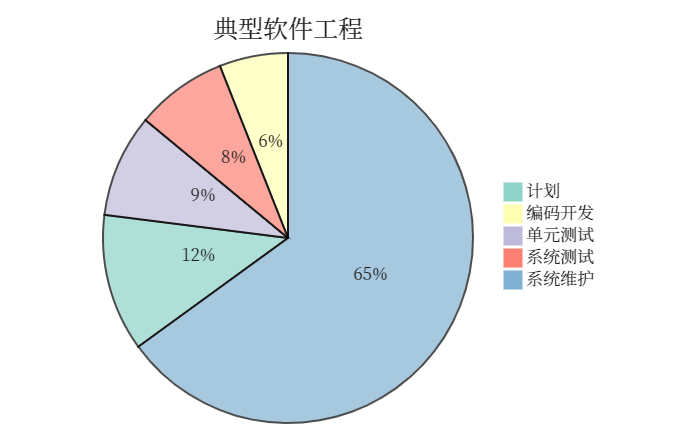
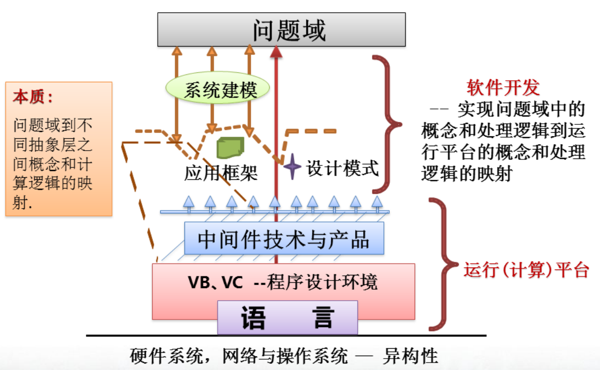
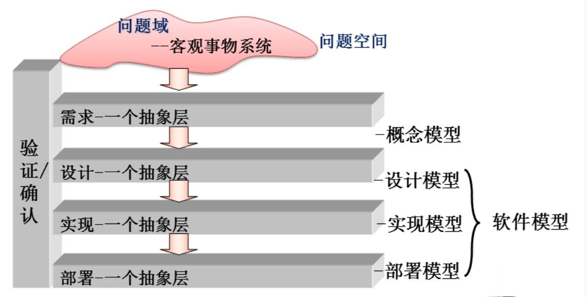
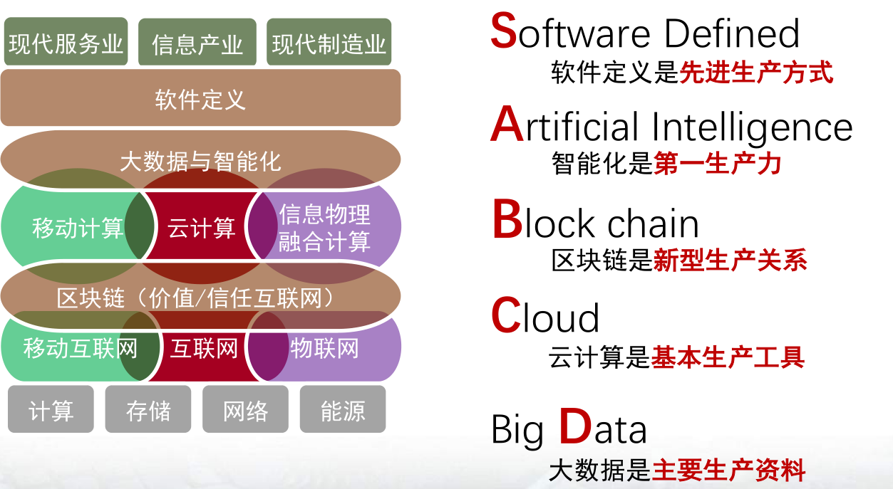

# 01 - 软件工程概述

## 1 软件

### 1.1 软件的定义

**软件是计算机系统中的程序及其文档**（计算机科学技术百科全书·第二版）：

- 程序是计算机任务的处理对象和处理规则的描述；
- 文档是为了便于了解程序所需的阐明性资料。

::: tip 重新定义软件：
软件是客观世界中问题空间与解空间的具体描述：
- 硬件只能执行无序且数量有限的指令集，软件则是通过数量不限的指令序列来指导硬件求解
- 必须由人“以程序的形式”告诉计算机如何通过一系列的简单运算来实现复杂运算
:::

### 1.2 软件的特点

- 软件是无形的、不可见的逻辑实体；
- 软件是设计开发的，而不是生产制造的；
- 软件在使用中没有磨损、老化的问题；
- 软件是定制开发的；
- 软件是复杂的；
- 软件的开发成本高；
- 软件易于复制；
- 软件质量要求较高
- 软件的开发和运行都离不开相关的计算机系统环境
- 软件开发工作牵涉到很多社会因素。

一个典型的软件项目，软件测试、系统维护占据工程很大一部分成本：

### 1.3 软件的种类

按照软件的功能划分：

1. **系统软件**：
	- 居于计算机系统中最靠近硬件的一层；
	- 其他软件一般都通过系统软件发挥作用，它与具体的应用领域无关，如编译程序和操作系统等；
	- 编译程序把程序人员用高级语言书写的翻译成与之等价的、可执行的低级语言程序；操作系统则负责管理系统的各种资源、控制程序的执行。
2. **支撑软件**：
	- 支撑软件的开发、维护与运行的软件；
	- 70 年代后期发展起来的软件开发环境以及后来的中间件则可被看成现代支撑软件的代表；
	- 软件开发环境主要包括***环境数据库***、各种***接口软件***和***工具组***，三者形成整体，协同支撑软件的开发与维护；
	- 中间件是一种软件，它处于系统软件（操作系统和网络软件）与应用软件之间，它能使远距离相隔的应用软件可协同工作（互操作）。
3. **应用软件**
	- 特定应用领域专用的软件；
	- 例如人口普查用的软件就是一种应用软件。

## 2. 软件工程的起源和概念

### 2.1 软件工程的起源

早期计算机程序：机器代码。

::: tip 现代认为
在信息产业中，微电子是基础，计算机和网络是载体，软件是核心。
:::

### 2.1 软件开发的三个时期

- 个人程序时期（1947 - 1950 年代末）：软件完全附属于硬件，昂贵单一。
- 软件作坊时期（1960 年代初 - 1960 年代末）：高级程序设计语言出现，软件需求和应用扩大，需要对软件开发进行管理协作。
- 软件工程时期（1970 年至今）：软件规模和复杂性不断增长。

为解决软件危机，1986 年 NATO（北大西洋公约组织）首次提出**软件工程**这一概念。其目的是：**倡导以工程的原理、原则和方法进行软件的开发，以解决软件危机**。

### 2.3 软件工程的定义

计算机百科全书上的**软件工程定义**：

- 应用计算机科学、数学及管理科学等原理，工程化方法制作软件的工程。它借鉴传统工程的原则、方法，创建软件以达到提高质量，降低成本的目的。
- 其中，计算机科学、数学用于构造模型与算法。工程科学用于制定规范、设计范型、评估成本及确定权衡，管理科学用于计划、资源、质量、成本等管理。
- 软件工程是一门指导计算机软件开发和维护的工程学科。软件工程是一门交叉性学科。

首次 NATO 会议上的**软件工程定义**：

- 软件工程是用来建立和使用合理的工程原则，以经济地获取可靠的。且在真实机器上可高效工作的软件。

IEEE（IEE93）中的**软件工程定义**：

- 将系统化的、规范的、可量化的方法应用到软件的开发、运行及维护中，即将工程化方法应用于软件；
- 对上述方法的研究。

## 3. 软件开发的本质和基本手段

### 3.1 软件开发的含义

软件开发本质：

- 不同抽象层术语之间的“映射”；
- 不同抽象层处理逻辑之间的“映射”。

### 3.2 实现映射的基本手段：建模

建模是解决问题的一般途径。建立问题模型是指：**应用掌握的知识，通过抽象，给出该问题的一个结构**。

模型是在特定意图下所确定的角度和抽象层次上对物理系统的描述，通常包含对该系统边界的描述，给出系统内各模型元素以及它们之间的语义关系。

将问题域到软件的过程分为多个抽象层，以控制开发的复杂性。一个抽象层是由一组确定的术语定义的。

## 4. 软件工程框架

### 4.1 软件工程的目标

生产具有**正确性**、**可用性**以及**开销合宜**的产品。

### 4.2 软件工程的活动

生产一个最终满足需求且达到工程目标的软件产品所需要的步骤。主要包括需求、设计、实现、确认和支持等活动：

- **需求**：定义问题，即建立系统模型。主要任务包括需求获取、需求定义、需求规约、需求验证。
- **设计**：在需求分析的基础上，给出系统的软件设计方案。设计包括总体设计（也称为概要设计）和详细设计。
- **实现**：把设计结果转换为可执行的程序代码。
- **确认**：确认活动贯穿于整个开发过程实现完成后的确认，保证最终产品满足用户的需求。确认活动主要包括：· 需求复审、设计复审以及程序测试。主要任务是：软件测试。
- **支持**：支持活动包括修改和完善。它为系统的运行提供完善性维护、纠错性维护和适应性维护。

### 4.3 软件工程原则

- 选取合适的开发模型
- 提供高质量的工程支持
- 重视开发过程的管理

### 4.4 软件工程框架的作用

软件工程可定义为三元组：**< 目标，原则，活动>**

1. 给出了软件所涉及软件工程的**工程要素**
2. 给出了**各要素之间的关系**
3. 给出了软件工程学科所**研究的主要内容**
	- 软件开发模型
	- 软件开发方法
	- 软件过程
	- 软件工具
	- 软件开发环境为
	- 计算机辅助软件工程（CASE）
	- 软件经济学

## 补充

**新一代信息技术体系及其经济学视角**：

