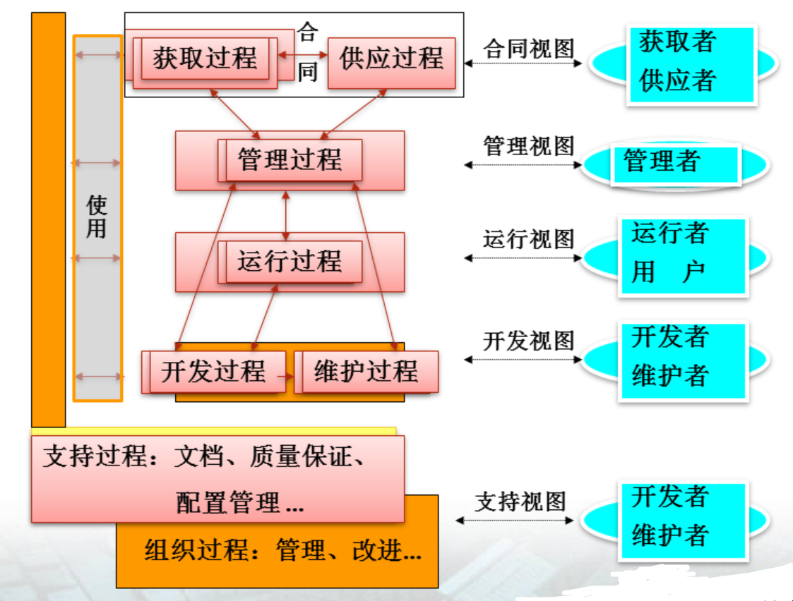

# 02 - 软件过程

## 1 软件生存周期过程的概念

::: tip
开发逻辑，是获取正确软件的关键。
:::

**软件生存周期**：软件产品或系统的一系列活动的全周期。从形成概念开始，历经开发、交付使用、在使用中不断修订和演化，直到最后被淘汰。

**软件生存周期过程（软件过程）**：

- 软件生存周期中的一系列相关过程。
- 为了表述软件开发需要做“什么活（映射）”，引入了以下三个概念：过程是活动的集合，活动是任务的集合，任务是把输入转换成输出的操作。

ISO/IEC 软件生存周期过程 12207-1995：

- 系统地给出了软件开发所需的任务，即回答了“软件开发需要做哪些基本“映射”
- ISO/IEC 12207-1995 补篇 1
- ISO/IEC 12207-1995 补篇 2

## 2 软件生存周期过程的分类

按**承担软件开发工作的主体**，将软件生存周期过程分为三类：

1. 基本过程（primary processes）
2. 支持过程（supporting processes）
3. 组织过程（institutional processes）

### 2.1 基本过程

是指那些与软件生产直接相关的活动集；又按过程中活动的不同主体，将基本过程（类）分为5个过程：

1. **获取过程**：获取过程是获取者（**需方**）所从事的活动和任务，其目的是获得满足客户所表达的那些要求的产品和/或服务。该过程以定义客户要求开始，以接受客户所要求的产品和/或服务结束。
2. **供应过程**：供应过程是**供方**为了向客户提供满足需求的软件产品或服务所从事的一系列活动和任务，其目的是向客户提供一个满足已达成需求的产品或服务。
3. **开发过程**：开发过程是**软件开发者**所从事的一系列活动和任务，其目的是将一组需求转换为一个软件产品或系统。
4. **运行过程**：运作过程是**系统操作者**所从事的一系列活动和任务。其目标是在软件产品预期的环境中运行该产品，并为该软件产品的维护提供支持。
5. **维护过程**：维护过程是**维护者**所从事的一系列的活动和任务。其目的是：对交付后的系统或软件产品，或为了纠正其错误，改进其性能或其它属性，而对其进行修改；或因环境变更，而对其进行调整。

### 2.2 支持过程

是有关各方按其目标所从事的一系列支持活动集。 又按过程中活动的不同主体，将支持过程（类）分为 8 个过程：

1. **文档过程**：为记录生存周期过程所产生的信息而定义的活动。
2. **配置管理过程**：应用管理上的和技术上的规程来支持整个软件生存周期的过程。
3. **质量保证过程**：为客观地保证软件产品和过程符合规定的需求以及已建立的计划而定义的活动。
4. **验证过程**：根据软件项目需求，按不同深度（为需方、供方或某独立方）验证软件产品而定义的活动。
5. **确认过程**：确认过程是一个确定需求和最终的、已建成的系统或软件产品是否满足特定预期用途的过程。
6. **联合评审过程**：为评价一项活动的状态和产品而定义的活动。
7. **审计过程**：确定遵照需求、计划合同的程度。
8. **问题解决过程**：为分析和解决问题而定义的活动。

### 2.3 组织过程

是指那些与软件生产组织有关的活动集。分为 7 个过程：

1. **管理过程**：管理过程是管理人员从事的、对其它过程进行管理的活动和任务。
2. **基础设施过程**：为其他过程建立和维护所需基础设施的过程。
3. **改进过程**：改进过程是管理人员从事的一组活动和任务，其目的是：建立、评价、测量、控制和改进软件生存周期过程。
4. **人力资源过程**：是为组织和项目提供具有技能和知识人员的过程。
5. **资产管理过程**：为组织的资产管理者而定义的活动。
6. **复用程序管理过程**：为组织的软件复用而定义的活动。
7. **领域软件工程过程**：为领域模型、领域软件体系结构的确定及该领域资产的开发和维护而定义的活动。

### 2.4 各类过程之间的关系

## 3 软件生存周期模型的概念

### 3.1 基本概念

软件生存周期模型（IEEE Standard 12207.0-1996）：

> 把一个软件生存周期模型描述为：一个包括软件产品开发、运行和维护中有关过程、活动和任务的框架，覆盖了从该系统的需求定义到系统的使用终止。

中国计算机科学与技术百科全书：

> 称软件生存周期模型为“软件开发模型”，并把它定义为：软件过程、活动、任务的结构框架。

### 3.2 软件开发模型

与软件生存周期模型为同一含义。

## 4 常见的软件生存周期模型

### 4.1 瀑布模型

1970年，W. Royce：

1. 瀑布模型将软件生存周期的各项活动规定为依固定顺序而连接的若干阶段工作：
2. 瀑布模型规定了每一阶段的输入，以及本阶段的工作成果，作为输出传入下一阶段。

具体过程：

1. 项目的开发依次经过：需求、设计、编码和单元测试、集成以及维护这一基本路径。
2. 通过每一阶段，提交以下产品：软件需求规约、设计文档、实际代码、测试用例、最终产品等。工作产品（又称可提交的产品，Deliverables）流经“正向”开发的基本步骤路径。
3. “反向”步骤流表示对前一个可提交产品的重复变更（又称为“返工”（Rework））。
	- 由于所有开发活动的非确定性，因此是否需要重复变更，这仅在下一个阶段或更后的阶段才能认识到。
	- 返工不仅在以前阶段的某一地方需要，而且对当前正在进行的工作也是需要的。

虽然瀑布模型是一个比较“老”的、甚至过时的开发模型，但其优点为：

1. 在决定系统怎样做之前，存在一个需求阶段，鼓励对系统“做什么”进行规约（即设计之前的规约）。
2. 在建造构件之前，存在一个设计阶段，鼓励规划系统结构（即编码之前的设计）。
3. 在每一阶段结束时进行复审，允许获取方和用户的参与。
4. 前一步工作产品可作为下一步被认可的、文档化的基线。允许基线和配置早期接受控制。

瀑布模型存在的不足：

1. 客户必须能够完整、正确和清晰地表达他们的需求：开发人员一开始就必须理解需求。
2. 缺乏灵活性。一旦软件需求存在偏差，就会导致开发出的软件产品不能满足用户的实际要求。
3. 在一个项目的早期阶段，过分地强调了基线和里程碑处的文档，可能要花费更多的时间，用于建立一些用处不大的文档。
4. 直到项目结束之前，都不能演示系统的能力，增加了项目的风险。

### 4.2 增量模型

该模型有一个假设，即需求可以分段，成为一系列增量产品，每一增量可以分别地开发。

增量模型作为瀑布模型的第一个变体，具有瀑布模型的所有优点。此外，它还有以下优点：

1. 第一个可交付版本所需要的成本和时间是很少的；
2. 开发由增量表示的小系统所承担的风险是不大的；
3. 由于很快发布了第一个版本，因此可以减少用户需求的变更；
4. 允许增量投资，即在项目开始时，可以仅对一个或两个增量投资。

注意：如果采用增量投资方式，那么客户就可以对一些增量进行招标。然后，开发人员按提出的截止期限进行增量开发，这样客户就可以用多个契约来管理组织的资源和成本。

如果增量模型不适于某些项目，或使用有误，则有以下缺点：

1. 如果没有对用户的变更要求进行规划，那么产生的初始增量可能会造成后来增量的不稳定；
2. 如果需求不像早期思考的那样稳定和完整，那么一些增量就可能需要重新开发，重新发布；
3. 管理发生的成本、进度和配置的复杂性，可能会超出一些组织的能力。

### 4.3 演化模型

是一种有弹性的过程模式，由一些小的开发步组成，每一步历经需求分析、设计、实现和验证，产生软件产品的一个增量。通过这些迭代，完成最终软件产品的开发。

- 针对事先不能完整地定义需求的软件开发
- 针对用户的核心需求，开发核心系统
- 根据用户的反馈，实施活动的迭代

### 4.4 喷泉模型

- 特征：迭代、无缝
- 与面向对象技术的关系

