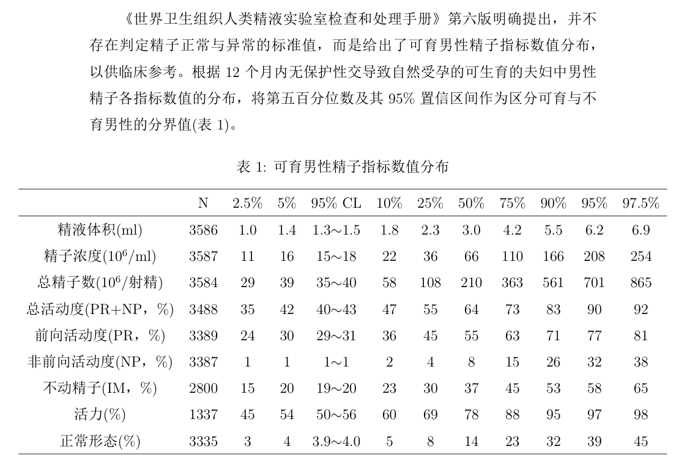

# LaTeX 技巧

## 1 基本设置

```latex
\documentclass[titlepage]{article}
% 正文字体为小四
\usepackage[zihao=-4]{ctex}
% 纸张大小与页边距
\usepackage[a4paper, top=2.54cm, bottom=2.54cm, left=3.18cm, right=3.18cm]{geometry}
% 行间距为1.5
\linespread{1.5}
```

## 2 目录

```latex
% 为所有目录层级加引导点
\usepackage{tocloft}
\renewcommand{\cftsecleader}{\cftdotfill{\cftdotsep}}
% 目录层级深度
\setcounter{tocdepth}{2}
% 目录生成标签
\usepackage[atend]{bookmark}
\bookmarksetup{
  open,
  openlevel=2,
  numbered
}
```

## 3 化学式的使用

```latex
\usepackage{mhchem}
\ce{C_2H_5OH}
```

## 4 插入图片

```latex
% 插入图片
\usepackage{graphicx}
\begin{figure}[htbp]
	\centering
	\includegraphics[width=0.8\textwidth]{src/example.png}
	\caption{Example Image}
	\label{fig:example}
\end{figure}

% 引用图片
\ref{fig:example}
```

## 5 插入表格

```latex
% 插入参考文献
\usepackage{cite}
% 参考文献格式
\usepackage{gbt7714}
% 表格过宽调整为居中
\usepackage{adjustbox}
\begin{table}[htbp]
	\centering
	\caption{可育男性精子指标数值分布}
	\label{tab:jzzb}
	\vspace{1em}
	\begin{adjustbox}{center}  % 表格过宽时调整表格整体为居中
		\begin{tabular}{cccccccccccc}
			\hline
			& N & 2.5\% & 5\% & 95\% CL & 10\% & 25\% & 50\% & 75\% & 90\% & 95\% & 97.5\%\\
			\hline
			精液体积(ml) & 3586 & 1.0 & 1.4 & 1.3$\sim$1.5 & 1.8 & 2.3 & 3.0 & 4.2 & 5.5 & 6.2 & 6.9\\
			精子浓度($10^6$/ml) & 3587 & 11 & 16 & 15$\sim$18 & 22 & 36 & 66 & 110 & 166 & 208 & 254\\
			总精子数($10^6$/射精) & 3584 & 29 & 39 & 35$\sim$40 & 58 & 108 & 210 & 363 & 561 & 701 & 865\\
			总活动度(PR+NP，\%) & 3488 & 35 & 42 & 40$\sim$43 & 47 & 55 & 64 & 73 & 83 & 90 & 92\\
			前向活动度(PR，\%) & 3389 & 24 & 30 & 29$\sim$31 & 36 & 45 & 55 & 63 & 71 & 77 & 81\\
			非前向活动度(NP，\%) & 3387 & 1 & 1 & 1$\sim$1 & 2 & 4 & 8 & 15 & 26 & 32 & 38\\
			不动精子(IM，\%) & 2800 & 15 & 20 & 19$\sim$20 & 23 & 30 & 37 & 45 & 53 & 58 & 65\\
			活力(\%) & 1337 & 45 & 54 & 50$\sim$56 & 60 & 69 & 78 & 88 & 95 & 97 & 98\\
			正常形态(\%) & 3335 & 3 & 4 & 3.9$\sim$4.0 & 5 & 8 & 14 & 23 & 32 & 39 & 45\\
			\hline
		\end{tabular}
	\end{adjustbox}
\end{table}

% 引用表格
\ref{tab:jzzb}
```

效果如下图：



# 6 参考文献

```latex
% 插入参考文献
\usepackage{cite}
% 参考文献格式
\usepackage{gbt7714}
\bibliographystyle{gbt7714-numerical}
% 引入参考文献
\bibliography{bibtex.bib}
% 参考文献加入目录
\addcontentsline{toc}{section}{参考文献}

% 引用参考文献
\cite{ckwx}
```